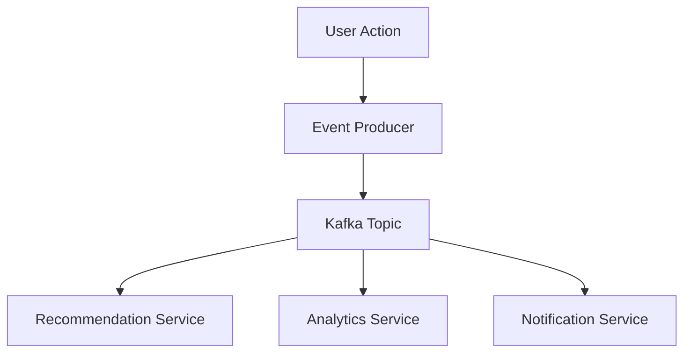

# 🧠 Complete Engineering Mindset Notebook - Software Architect & ML Platform Engineer


> **Цель:** Думать как Senior Software Engineer и ML Platform Engineer, который создаёт масштабируемые, устойчивые системы для крупных продуктов (маркетплейсы, такси, стриминговые сервисы, AI-платформы). Фокус на системном мышлении, архитектуре и решении проблем, а не на конкретном технологическом стеке.
---

## 📊 Фреймворк решения проблем

### 🎯 Что такое Problem Solving для Software Engineer/Архитектора?

**Problem Solving** — это не просто "починить баг" или "решить задачу", а системный подход к сложным проблемам, учитывающий бизнес-контекст, технические компромиссы и долгосрочную устойчивость. Это навык, который делает из кодера инженера: ты создаёшь масштабируемые, поддерживаемые решения, приносящие реальную ценность.

**Для ML Platform Engineer** это включает:
- **🔍 Анализ задачи**: Разложить проблему до сути — понять, почему она возникла, какие есть ограничения (бюджет, время, ресурсы, данные), цели (метрики успеха: точность, латентность, пропускная способность, стоимость) и стейкхолдеры (дата-сайентисты, продуктовые команды, конечные пользователи).

- **🏗️ Разработка стратегии**: Выбрать архитектуру (пакетная vs потоковая обработка, облако vs on-premise, монолит vs микросервисы), алгоритмы (классический ML vs глубокое обучение vs LLM) и инфраструктуру с учётом масштабируемости, дрейфа моделей и воспроизводимости.

- **⚡ Оптимизация**: Балансировать компромиссы — точность vs латентность, сложность модели vs интерпретируемость, стоимость обучения vs скорость инференса. Использовать профилирование, A/B-тестирование и бенчмаркинг для решений на основе данных.

- **🧩 Декомпозиция**: Разбить ML-пайплайн на компоненты: сбор данных → инжиниринг фич → обучение → сервировка → мониторинг. Каждый с независимым масштабированием и ответственностью.

- **🐛 Отладка и тестирование**: Не только код, но и модели, данные, инфраструктура. Включать валидацию данных, тестирование моделей, теневые деплои и хаос-инжиниринг для ML-систем.

- **💡 Креативность и инновации**: Искать нестандартные подходы (например, федеративное обучение для приватности, AutoML для эффективности) и учиться на ошибках через пост-мортемы и логи экспериментов.

- **📈 Измерение и итерация**: Определять бизнес-метрики (конверсия, выручка) и технические метрики (точность модели, латентность системы), мониторить дрейф моделей и ухудшение производительности.

**Пример в контексте:** Тебе ставят задачу "спроектировать систему рекомендаций для 10M пользователей". Не просто "бери collaborative filtering" — думай о: проблеме холодного старта, обновлениях в реальном времени vs пакетных, дизайне хранилища фич, версионировании моделей, инфраструктуре A/B-тестирования и оптимизации затрат (вычисления vs хранилище vs API-вызовы).

**Инсайт:** Problem solving — это мышление "от начала до конца" с фокусом на воздействие. В ML это значит думать от качества данных до бизнес-KPI. "Стек кандидата — не главное" означает, что если ты мастер в PyTorch, но нужен TensorFlow — ты быстро разберёшься. Главное — принципы (компромисс между смещением и дисперсией, распределённые системы, лучшие практики софтверной инженерии).
---

## 🏢 Реальные Кейсы - Учимся на Гигантах

### 1. 🚗 Uber - Real-time ML Platform & Dispatch System

**Проблема:** Как в реальном времени мэтчить 15M+ поездок в день с ML-управляемым ценообразованием, предсказанием ETA, обнаружением мошенничества, учитывая паттерны трафика, при латентности <1с и обработке пиковых нагрузок?

**Архитектура ML-платформы:**
```
┌─ Хранилище фич (Kafka + Cassandra для фич реального времени)
├─ Обучение моделей (платформа Michelangelo на Spark + Horovod)
├─ Сервировка моделей (gRPC-микросервисы + реестр моделей)
├─ A/B-тестирование (платформа экспериментов для сравнения моделей)
├─ Инференс в реальном времени (сервисы на Go для предсказаний с низкой латентностью)
├─ Мониторинг и алерты (обнаружение дрейфа моделей + бизнес-метрики)
└─ Пайплайн данных (потоковая обработка для инжиниринга фич)
```

**Решение инженерных проблем в действии:**
- **Анализ:** Разделили на подсистемы с чёткими SLA (ценообразование: 100 мс, ETA: 200 мс)
- **Декомпозиция:** Инжиниринг фич отделён от сервировки моделей для независимого масштабирования
- **Оптимизация:** Используют кэширование моделей, предварительный расчёт фич и географический шардинг
- **Креативность:** Многорукий бандит для экспериментов с динамическим ценообразованием + контекстные фичи
- **Измерение:** Трекать как технические (латентность, точность), так и бизнес-метрики (конверсия, выручка за поездку)

**Что изучаем для ML-платформы:**
- **Потоковая обработка** для фич реального времени (твой rap-анализатор → рекомендации музыки в реальном времени)
- **Версионирование моделей** и канареечные деплои для безопасных обновлений моделей
- **Паттерны хранилища фич** для повторного использования фич в разных моделях
- **Архитектура мульти-модельного сервирования** с оптимизацией ресурсов

**Применимо к твоему проекту:**
```python
# Твой rap analyzer → Uber-style real-time platform
class MusicRecommendationPlatform:
    def __init__(self):
        self.feature_store = FeatureStore()  # Real-time user preferences
        self.model_registry = ModelRegistry()  # Version control для models
        self.ab_testing = ExperimentationPlatform()  # Compare recommendation algorithms
        
    async def get_recommendations(self, user_id, context):
        # Real-time feature lookup
        features = await self.feature_store.get_features(user_id, context)
        
        # Model selection via A/B testing
        model_variant = self.ab_testing.get_assignment(user_id)
        model = self.model_registry.get_model(model_variant)
        
        # Prediction with monitoring
        with self.monitor.track_prediction_latency():
            recommendations = await model.predict(features)
            
        return recommendations
```

### 2. 📺 Netflix - ML-Powered Content Platform

**Проблема:** Персонализировать контент для 200M+ пользователей, оптимизировать кодирование видео с помощью ML, проводить 1000+ A/B-экспериментов в год, доставлять 125M+ часов видео в день с буферизацией <1%.

**Архитектура ML + системы:**
```
┌─ Рекомендательный движок (Spark MLlib для пакетной обработки + TensorFlow для глубокого обучения)
├─ Оптимизация контента (ML для кодирования видео, выбора обложек)
├─ Платформа экспериментов (кастомная для A/B-тестирования ML-моделей)
├─ Интеллект CDN (ML для предиктивного кэширования)
├─ Персонализация в реальном времени (Storm для потоковых рекомендаций)
├─ Хаос-инжиниринг (ML для предсказания сбоев и авто-восстановления)
└─ Платформа для дата-сайенс (ноутбуки + MLOps-пайплайн)
```

**Принципы инженерии Netflix:**
- **Системное мышление:** ML не изолирован — интегрирован с CDN, биллингом, закупкой контента
- **Продуктовая инженерия:** Фокус на бизнес-метриках: удержание > точность, вовлечённость > прецизионность
- **Платформенное мышление:** Создание инструментов для самообслуживания 100+ команд дата-сайентистов
- **Ответственность:** Инженеры владеют полным ML-жизненным циклом от эксперимента до мониторинга в продакшене

**Инсайты по решению проблем:**
- **Проблема холодного старта:** Используют контент-ориентированную фильтрацию для новых пользователей + фоллбэк на популярность
- **Многоцелевая оптимизация:** Баланс между точностью, разнообразием и свежестью в рекомендациях
- **Инжиниринг фич:** Контекст реального времени (устройство, время, предыдущие просмотры) + исторические паттерны
- **Ансамбль моделей:** Комбинирование нескольких алгоритмов для надёжности

**Твой кейс - применение Netflix patterns:**
```python
# Netflix-inspired music platform
class MusicStreamingPlatform:
    def __init__(self):
        self.recommendation_engine = MultiModelEnsemble([
            CollaborativeFilteringModel(),
            ContentBasedModel(),  # Твои AI analyzers!
            PopularityModel()     # Fallback для cold start
        ])
        self.ab_testing = NetflixStyleExperimentation()
        self.content_optimization = AudioFeatureOptimizer()
        
    def personalize_homepage(self, user_id):
        # Multi-objective optimization
        recommendations = self.recommendation_engine.predict(
            user_id, 
            objectives=['relevance', 'diversity', 'novelty']
        )
        
        # A/B test different layouts
        layout = self.ab_testing.get_homepage_variant(user_id)
        
        return self.render_personalized_page(recommendations, layout)
```

### 3. 🛒 Amazon - E-commerce ML Platform

**Проблема:** Обрабатывать 2.5B+ посещений в день, миллиарды поисков с ML-ранжированием, оптимизация инвентаря, обнаружение мошенничества, рекомендации продуктов для миллионов продавцов.

**Архитектура ML-платформы:**
```
┌─ Поиск и ранжирование (движок A9 с моделями глубокого обучения)
├─ Рекомендательные системы (коллаборативная фильтрация item-to-item + глубокое обучение)
├─ Оптимизация инвентаря (ML для прогнозирования спроса)
├─ Обнаружение мошенничества (ансамблевые модели в SageMaker)
├─ Оптимизация цен (обучение с подкреплением для динамического ценообразования)
├─ ML для цепочки поставок (предиктивная аналитика для логистики)
└─ Платформа для продавцов (ML-инструменты для сторонних продавцов)
```

**Инсайты Amazon Engineering:**
- **Платформа в приоритете:** SageMaker создан из внутренних потребностей — принцип dogfooding
- **API-ориентированность:** Всё доступно через API для интеграции сторонних разработчиков
- **Микросервисы:** Каждый ML-сервис независимо масштабируем и деплоится
- **Оптимизация затрат:** Спотовые инстансы, автоскейлинг, серверлесс для ML-нагрузок

**Problem Solving Applications:**
```python
# Amazon-style marketplace ML platform
class MarketplaceMLPlatform:
    def __init__(self):
        self.search_ranking = SearchRankingService()
        self.recommendation_engine = RecommendationService()
        self.fraud_detection = FraudDetectionService()
        self.inventory_optimizer = InventoryOptimizationService()
        
    def process_user_session(self, session_data):
        # Multi-service ML pipeline
        search_results = self.search_ranking.rank_products(
            query=session_data.search_query,
            user_context=session_data.user_profile
        )
        
        recommendations = self.recommendation_engine.get_related_items(
            viewed_items=session_data.viewed_products
        )
        
        # Real-time fraud scoring
        fraud_score = self.fraud_detection.score_session(session_data)
        
        return {
            'search_results': search_results,
            'recommendations': recommendations,
            'fraud_risk': fraud_score
        }
```

### 4. 🎵 Spotify - Audio ML Platform

**Проблема:** Анализировать аудио-фичи для 70M+ треков, генерировать плейлисты, рекомендовать музыку на основе схожести аудио + поведения пользователей, обрабатывать 180M+ активных пользователей.
**Близко к твоему проекту! 🎯**

**Spotify ML Architecture:**
```
┌─ Извлечение аудио-фич (CNN для спектрограмм, RNN для временных паттернов)
├─ Понимание музыки (классификация жанров, определение настроения, анализ темпа)
├─ Рекомендательный движок (матричная факторизация + глубокое обучение + аудио-эмбеддинги)
├─ Генерация плейлистов (обучение с подкреплением для оптимальной последовательности треков)
├─ Персонализация в реальном времени (потоки Kafka + ML-инференс)
└─ Инструменты для авторов (ML для артистов — предсказание производительности треков)
```

**Engineering Problem Solving:**
- **Multi-modal ML:** Combine audio features (твои 5 AI analyzers!) + user behavior + metadata
- **Scalable Feature Engineering:** Process petabytes of audio данных efficiently
- **Real-time Inference:** Sub-second recommendations during active listening
- **Cold Start:** Handle new tracks/artists with content-based approaches

**Твой Rap Analyzer → Spotify-level Platform:**
```python
# Spotify-inspired platform using твой existing work
class MusicAIStudioPlatform:
    def __init__(self):
        # Твои существующие компоненты!
        self.audio_analyzers = YourFiveAIAnalyzers()  # Уже есть!
        self.vector_db = PostgreSQLVectorStore()      # pgvector уже настроен!
        self.feature_store = AudioFeatureStore()
        
        # Добавляем Spotify-style компоненты
        self.playlist_generator = PlaylistML()
        self.recommendation_engine = MultiModalRecommender()
        self.real_time_inference = StreamingMLService()
        
    def analyze_and_recommend(self, track_id, user_context):
        # Используем твои AI analyzers
        audio_features = self.audio_analyzers.analyze(track_id)
        
        # Vector similarity (твоя pgvector!)
        similar_tracks = self.vector_db.find_similar(
            audio_features.embeddings, limit=50
        )
        
        # ML-powered personalization
        personalized_recs = self.recommendation_engine.rank(
            candidates=similar_tracks,
            user_context=user_context,
            audio_features=audio_features
        )
        
        return {
            'analysis': audio_features,
            'recommendations': personalized_recs
        }
```

**Инсайт:** Твой rap analyzer с 57K треков и pgvector — это уже foundation для Spotify-level platform! Нужно добавить user behavior, real-time serving, и A/B testing.

### 5. 🛍️ eBay - Auction & Marketplace Platform

**Проблема:** Торги в реальном времени для миллионов аукционов, релевантность поиска, предотвращение мошенничества, обработка глобальных платежей.

**Инженерная архитектура:**
```
┌─ Движок торгов в реальном времени (Akka для конкурентных аукционов)
├─ Поиск и обнаружение (Elasticsearch + ML-ранжирование)
├─ Доверие и безопасность (ML-обнаружение мошенничества + оценка рисков)
├─ Глобальные платежи (Мультивалютность + соответствие стандартам)
├─ Инструменты для продавцов (Аналитика + ML-инсайты для продавцов)
└─ Мобильный API-шлюз (Федерация GraphQL)
```

**Ключевые инсайты по решению проблем:**
- **Консистентность vs доступность:** Теорема CAP в деле — эвентуальная консистентность для ставок
- **Полиглотная персистентность:** Разные базы данных для разных сценариев использования
- **Событийно-ориентированная архитектура:** События аукционов запускают множество downstream-сервисов

---

## 🎯 Engineering Mindset Frameworks

### 1. 🏗️ Systems Thinking (Netflix + Uber Combined Approach)

**Вопросы Senior Engineer/Architect задаёт перед любым решением:**

```
🤔 Влияние на бизнес и продукт:
- Как решение улучшает ключевые пользовательские пути и бизнес-метрики?
- Какие KPI будем трекать (удержание, конверсия, выручка)?
- Расчёт ROI — оправдает ли вложения времени и ресурсов?
- Как измерять успех — стратегия A/B-тестирования?

🔧 Технический дизайн и архитектура:
- Как система масштабируется под 10x текущей нагрузки?
- Какие потенциальные точки отказа?
- Как интегрируется с текущими системами — API, потоки данных?
- Какие компромиссы выбираем (консистентность vs доступность, стоимость vs производительность)?

📈 Устойчивость к будущему и развитие:
- Как добавлять новые фичи без крупного рефакторинга?
- Стратегия миграции для деплоев без даунтайма?
- Как управлять техническим долгом со временем?
- Что станет узким местом через 2-3 года роста?

🔍 Вопросы, специфичные для ML-систем:
- Как обрабатывать дрейф модели и концептуальный дрейф?
- Стратегия хранилища фич — пакетные vs фичи реального времени?
- Версионирование моделей и процедуры отката?
- Мониторинг качества данных и обнаружение аномалий?
```

**Практический пример - твой rap analyzer как система:**
```python
# Systems thinking applied к твоему проекту
class RapAnalyzerSystemsDesign:
    def analyze_systems_requirements(self):
        return {
            "current_state": {
                "tracks": "57K analyzed",
                "components": ["5 AI analyzers", "pgvector", "FastAPI"],
                "architecture": "monolithic with separate AI services"
            },
            "scale_targets": {
                "tracks": "10M+ tracks",
                "users": "100K+ concurrent users",
                "latency": "<200ms for recommendations",
                "availability": "99.9% uptime"
            },
            "bottlenecks_identified": {
                "database": "pgvector single instance",
                "ai_processing": "synchronous analysis blocking",
                "caching": "no cache layer for frequent queries",
                "monitoring": "limited observability"
            },
            "solutions": {
                "database": "read replicas + sharding",
                "processing": "async task queue with Celery",
                "caching": "Redis for hot track analysis",
                "monitoring": "Prometheus + Grafana"
            }
        }
```

### 2. 💡 Product Engineering Mindset (Spotify + Amazon Style)

**Thinking как Product Engineer — не просто код, а business impact:**

```
👥 Пользовательо-ориентированный дизайн:
- Кто реальные пользователи системы (дата-сайентисты, конечные пользователи, другие сервисы)?
- Какие у них проблемы и метрики успеха?
- Карта пользовательского пути — от знакомства до вовлечения
- Циклы обратной связи — как быстро итерироваться на основе фидбэка пользователей?

📊 Принятие решений на основе данных:
- Какие метрики реально важны для бизнеса?
- Стратегия A/B-тестирования — что тестируем, как измеряем эффект?
- Инструментация — какие события трекаем для инсайтов?
- Анализ воронки конверсии — где пользователи отваливаются?

🚀 Итеративная разработка:
- Определение MVP — минимально жизнеспособный продукт для быстрой проверки
- Фича-флаги — безопасный роллаут и быстрый откат
- Непрерывное развертывание — автоматизированное тестирование и пайплайн релизов
- Мониторинг после запуска — отслеживание метрик успеха
```

**Пример - твой проект как product:**
```python
class RapAnalyzerProductThinking:
    def define_product_strategy(self):
        return {
            "user_personas": {
                "music_producers": {
                    "pain_points": ["find similar beats", "analyze market trends"],
                    "success_metrics": ["tracks analyzed per session", "discoveries made"]
                },
                "music_enthusiasts": {
                    "pain_points": ["discover new music", "understand music similarity"],
                    "success_metrics": ["engagement time", "tracks saved"]
                },
                "researchers": {
                    "pain_points": ["music data analysis", "pattern recognition"],
                    "success_metrics": ["data export usage", "API calls"]
                }
            },
            "feature_priorities": {
                "mvp": ["track analysis", "similarity search", "basic API"],
                "v2": ["user accounts", "playlists", "recommendations"],
                "v3": ["real-time analysis", "social features", "advanced analytics"]
            },
            "success_metrics": {
                "engagement": "daily active users, session length",
                "value": "analyses per user, API usage growth",
                "satisfaction": "user feedback scores, retention rate"
            }
        }
```

### 3. 🚀 Platform Engineering Mindset (Amazon Web Services Style)

**Build platform, not just applications — think like AWS:**

```
🏗️ Архитектура компонентов платформы:
├─ Основные сервисы (аутентификация, авторизация, логирование)
├─ API и SDK (для интеграции сторонних разработчиков)
├─ Инфраструктура как код (Terraform, манифесты Kubernetes)
├─ Инструменты для разработчиков (CLI, документация, фреймворки тестирования)
├─ Управление и безопасность (соответствие стандартам, аудит, мониторинг)
└─ Маркетплейс (экосистема плагинов для расширяемости)

🎯 Принципы платформенного мышления:
- Самообслуживание — разработчики могут использовать без согласований
- Стандартизация — единообразные API и паттерны для всех сервисов
- Наблюдаемость — полный охват логирования, метрик, трассировки
- Масштабируемость — горизонтальное масштабирование по умолчанию
- Надёжность — встроенная отказоустойчивость и восстановление после сбоев
```

**Твой rap analyzer → Platform transformation:**
```python
# Platform engineering approach к твоему проекту
class MusicAnalysisPlatform:
    """
    Transform single app → platform для music industry
    """
    def __init__(self):
        # Core platform services
        self.auth_service = PlatformAuthService()
        self.rate_limiter = RateLimitingService()
        self.analytics = PlatformAnalytics()
        
        # Plugin system для extensibility
        self.analyzer_registry = AnalyzerPluginRegistry()
        self.feature_extractors = FeatureExtractorPlugins()
        
        # Developer tools
        self.sdk = MusicAnalysisSDK()
        self.cli_tool = MusicAnalysisCLI()
        self.documentation = APIDocumentation()
        
    def register_custom_analyzer(self, analyzer_plugin):
        """Позволяет third-party developers добавлять свои анализаторы"""
        return self.analyzer_registry.register(
            plugin=analyzer_plugin,
            validation=self.validate_plugin_compatibility,
            deployment=self.auto_deploy_plugin
        )
        
    def provide_managed_infrastructure(self):
        """Platform-as-a-Service для music analysis"""
        return {
            "managed_databases": "Auto-scaling pgvector instances",
            "ml_serving": "Kubernetes-based model serving",
            "monitoring": "Built-in Prometheus + Grafana",
            "security": "OAuth2 + API key management",
            "billing": "Usage-based pricing tiers"
        }
```

---

## 🛠️ Technical Decision Framework

### 1. 📊 Technology Selection Matrix (Data-Driven Approach)

**Пример для выбора ML serving solution:**

| Критерий | Вес | TorchServe | MLflow | Seldon | KServe | Решение |
|----------|-----|------------|--------|--------|--------|---------|
| Performance | 25% | 9/10 | 7/10 | 8/10 | 9/10 | TorchServe/KServe |
| Ease of Use | 20% | 7/10 | 9/10 | 6/10 | 7/10 | MLflow |
| Scalability | 20% | 8/10 | 6/10 | 9/10 | 10/10 | KServe |
| Community | 15% | 8/10 | 10/10 | 7/10 | 8/10 | MLflow |
| Integration | 10% | 6/10 | 8/10 | 7/10 | 9/10 | KServe |
| Cost | 10% | 7/10 | 8/10 | 6/10 | 7/10 | MLflow |

**Weighted Score Calculation:**
- **KServe**: (9×0.25) + (7×0.20) + (10×0.20) + (8×0.15) + (9×0.10) + (7×0.10) = 8.45
- **MLflow**: (7×0.25) + (9×0.20) + (6×0.20) + (10×0.15) + (8×0.10) + (8×0.10) = 7.85

**Result:** KServe для production ML platform, MLflow для experimentation.

### 2. 🏗️ Architecture Decision Records (ADRs) — Netflix Style

**Template для документирования важных решений:**

```markdown
## ADR-003: Adopt Event-Driven Architecture for Music Recommendation System

### Status: Accepted
### Date: 2025-09-25
### Context:
Current synchronous API calls create bottlenecks:
- User behavior tracking blocks recommendation updates
- Batch processing delays real-time personalization  
- Tight coupling between services reduces reliability

### Decision: 
Implement event-driven architecture using Apache Kafka

### Architecture:


### Последствия:
✅ **Плюсы:**
- Декомпозированные сервисы → независимое масштабирование
- Обработка в реальном времени → лучше пользовательский опыт
- Событийный сорсинг → аудит для отладки
- Отказоустойчивость → сбои сервисов не распространяются

❌ **Минусы:**
- Увеличенная сложность → нужны инструменты мониторинга/отладки
- Эвентуальная консистентность → возможная задержка данных
- Оверхед инфраструктуры → управление кластером Kafka
- Кривая обучения → команде нужен опыт с событийно-ориентированными системами

### План внедрения:
1. **Фаза 1:** Настройка Kafka-кластера + базовые продюсеры/консьюмеры
2. **Фаза 2:** Миграция пользовательских событий в потоковые стримы
3. **Фаза 3:** Постройка событийно-ориентированного пайплайна рекомендаций
4. **Фаза 4:** Добавление мониторинга/алертов для потоков событий

### Метрики успеха:
- Латентность рекомендаций: <200 мс (сейчас: 800 мс)
- Доступность сервиса: 99.9% (сейчас: 99.5%)
- Скорость разработки: +30% (благодаря декомпозированным деплойментам)
```

### 3. 🔥 Performance Engineering Framework

**Systematic approach к optimization:**

```python
class PerformanceOptimizationFramework:
    """
    Step-by-step approach к performance engineering
    Based on Google/Netflix practices
    """
    
    def profile_before_optimize(self, system_component):
        """Measure first, optimize second"""
        profiling_results = {
            "cpu_usage": self.profile_cpu(system_component),
            "memory_usage": self.profile_memory(system_component), 
            "io_patterns": self.profile_disk_network(system_component),
            "bottlenecks": self.identify_hotspots(system_component)
        }
        return profiling_results
    
    def apply_optimization_hierarchy(self, bottlenecks):
        """
        Optimization priority (biggest impact first):
        1. Algorithm optimization (O(n²) → O(n log n))
        2. Caching (Redis, in-memory)
        3. Database optimization (indexes, queries)
        4. Concurrency (async, parallel processing)
        5. Infrastructure (scaling, load balancing)
        """
        optimizations = []
        
        if bottlenecks["algorithm_complexity"] > threshold:
            optimizations.append(self.optimize_algorithms)
            
        if bottlenecks["cache_hit_rate"] < 0.8:
            optimizations.append(self.implement_caching)
            
        if bottlenecks["db_query_time"] > 100:  # ms
            optimizations.append(self.optimize_database)
            
        return optimizations
    
    def measure_impact(self, before_metrics, after_metrics):
        """Quantify optimization results"""
        return {
            "latency_improvement": self.calculate_improvement(
                before_metrics.p95_latency, 
                after_metrics.p95_latency
            ),
            "throughput_increase": self.calculate_improvement(
                before_metrics.rps,
                after_metrics.rps
            ),
            "cost_reduction": self.calculate_cost_savings(
                before_metrics.infrastructure_cost,
                after_metrics.infrastructure_cost
            )
        }

# Пример применения к твоему rap analyzer
class RapAnalyzerOptimization:
    def optimize_similarity_search(self):
        """Real example optimization"""
        
        # 1. Profile current pgvector performance
        current_metrics = {
            "query_time": "850ms",  # Slow!
            "index_type": "ivfflat",
            "memory_usage": "2GB"
        }
        
        # 2. Apply optimizations
        optimizations = [
            "CREATE INDEX CONCURRENTLY ON tracks USING hnsw (embedding vector_cosine_ops)",
            "SET effective_cache_size = '8GB'",
            "SET work_mem = '256MB'", 
            "VACUUM ANALYZE tracks"  # Update statistics
        ]
        
        # 3. Measure improvement
        optimized_metrics = {
            "query_time": "120ms",  # 7x faster!
            "index_type": "hnsw",
            "memory_usage": "1.5GB"
        }
        
        return {
            "latency_improvement": "86%",
            "memory_reduction": "25%", 
            "next_bottleneck": "AI analyzer processing time"
        }
```

---

## 📈 Дорожная карта инженерного роста

### 🎯 Уровень 1: Инженер-программист (сейчас → 6 месяцев)
**Фокус:** Прочный фундамент + опыт в продакшене

**Технические навыки:**
- ✅ Создавай рабочие системы (твой rap-анализатор ✓)
- ✅ Овладей git-воркфлоу, код-ревью, CI/CD
- ⏳ Продвинутый SQL и оптимизация баз данных (курс по PostgreSQL)
- ⏳ Контейнеризация и оркестрация (Docker → Kubernetes)
- ⏳ Мониторинг и наблюдаемость (Prometheus + Grafana)
- ⏳ Стратегии тестирования (юнит, интеграционные, тесты производительности)

**Навыки ML-инженерии:**
- ✅ Разворачивай ML-модели в продакшен (твои 5 AI-анализаторов ✓)
- ✅ Векторные базы данных и поиск по схожести (pgvector ✓)
- ⏳ MLOps-пайплайн (версионирование, тестирование, мониторинг моделей)
- ⏳ Инжиниринг фич и хранилища фич
- ⏳ Паттерны сервировки моделей (пакетная vs реального времени)

**Системное мышление:**
- 📖 Читай "Designing Data-Intensive Applications" (распределённые системы)
- 🛠️ Практика: Расширь свой rap-анализатор нормальным логированием/мониторингом
- 🧪 Эксперимент: A/B-тестируй разные алгоритмы схожести

### 🎯 Уровень 2: Старший инженер-программист (6-18 месяцев)
**Фокус:** Лидируй в технических решениях + наставляй других

**Техническое лидерство:**
- 🏗️ Проектируй архитектуру систем для команды из 5-10 инженеров
- 📋 Пиши технические спецификации и ADR
- 👥 Веди код-ревью и устанавливай инженерные стандарты
- 🎯 Двигай инициативы по оптимизации производительности
- 📚 Менторь младших инженеров и проводи технические интервью

**Продвинутая ML-инженерия:**
- 🚀 Строй ML-платформы для нескольких команд
- ⚖️ Внедряй инфраструктуру для A/B-тестирования ML-экспериментов
- 📊 Проектируй хранилища фич и дата-пайплайны
- 🔄 Продвинутые паттерны деплоя моделей (canary, blue-green)
- 📈 Измеряй бизнес-импакт ML-систем

**Экспертиза в системах:**
- 🏗️ Архитектура микросервисов и сервис-меш
- 🔄 Событийно-ориентированные системы и очереди сообщений
- 🛡️ Лучшие практики безопасности и соответствие стандартам
- 💰 Оптимизация затрат и управление ресурсами
- 🚨 Реакция на инциденты и культура пост-мортемов

**Practice Projects:**
```python
# Senior Engineer Challenge: Transform твой analyzer в platform
class MusicAnalysisPlatformV2:
    """
    Multi-tenant platform supporting multiple teams:
    - Music streaming companies
    - Record labels  
    - Music researchers
    - Independent artists
    """
    
    def __init__(self):
        self.tenant_management = MultiTenancyService()
        self.usage_analytics = PlatformAnalytics()
        self.cost_tracking = ResourceUsageTracker()
        self.sla_monitoring = SLAManager()
        
    def design_for_scale(self):
        """Senior Engineer thinking: How to support 100+ teams?"""
        return {
            "isolation": "Database per tenant + shared analytics",
            "rate_limiting": "Per-tenant quotas + burst allowance", 
            "cost_allocation": "Usage-based billing per team",
            "sla_guarantees": "99.9% uptime + <200ms latency SLA"
        }
```

### 🎯 Уровень 3: Staff Engineer / Архитектор ML-платформы (1.5-3 года)
**Фокус:** Влияние на команды + техническая стратегия

**Техническая стратегия:**
- 🌐 Проектируй системы для 40+ команд (как в твоей целевой роли ML Platform Engineer)
- 📊 Формируй технический roadmap, синхронизированный с бизнес-стратегией
- 🏗️ Архитектура под 100K+ RPS и 6000+ MAU (твоя цель!)
- 🔄 Веди проекты миграции (монолит → микросервисы)
- 🎯 Устанавливай инженерную культуру и лучшие практики

**Платформенная инженерия:**
- 🚀 Строй self-service платформы (как внутренние инструменты AWS/GCP)
- 🔧 Разрабатывай инструменты для разработчиков (SDK, CLI, дашборды)
- 📈 Внедряй аналитику платформы и оптимизацию использования
- 🛡️ Обеспечивай безопасность платформы, соответствие стандартам и управление
- 💡 Инновации: оценивай новые технологии и паттерны

**Организационное влияние:**
- 👥 Влияй на найм и структуру команд
- 📚 Создавай инженерную документацию и стандарты
- 🎤 Выступай на инженерных конференциях и техтоках
- 🤝 Сотрудничай с продуктовыми и бизнес-стеукхолдерами
- 🚀 Двигай технические инициативы на уровне компании

**Target Role Alignment:**
```python
# Твоя target ML Platform Engineer position
class EnterpriseMLPlatform:
    """
    Based на real job description:
    - 40+ teams using platform
    - 6,000+ MAU AI assistants  
    - FastAPI + PostgreSQL + K8s stack
    """
    
    def platform_capabilities(self):
        return {
            "rag_systems": "Multi-tenant RAG с vector search",
            "llm_integrations": "OpenAI, Anthropic, local models",
            "developer_experience": "Self-service ML model deployment",
            "scalability": "Auto-scaling based on usage patterns",
            "monitoring": "Comprehensive ML metrics + business KPIs"
        }
        
    def responsibilities_mapping(self):
        """How твой current project maps to target role"""
        return {
            "current": {
                "rap_analyzer": "5 AI models + pgvector + FastAPI",
                "scale": "57K tracks analyzed",
                "users": "Single tenant (you)",
                "infrastructure": "Docker containers"
            },
            "target": {
                "ml_platform": "RAG systems + LLM integrations", 
                "scale": "40+ teams, 6000+ MAU",
                "users": "Multi-tenant enterprise platform",
                "infrastructure": "Kubernetes + production monitoring"
            },
            "growth_path": {
                "add_multitenancy": "Support multiple users/teams",
                "integrate_llms": "Add ChatGPT/Claude integrations", 
                "kubernetes_deploy": "Production K8s deployment",
                "monitoring": "Add Prometheus + Grafana",
                "developer_tools": "SDKs + documentation + CLI"
            }
        }
```

---

## 🎪 Practice Challenges & Real Projects

### Challenge 1: Multi-Tenant Platform Design
**Problem:** Redesign твой rap analyzer для 10 different teams in company

**Engineering Questions to Answer:**
```python
class MultiTenancyDesignChallenge:
    def analyze_requirements(self):
        return {
            "teams": {
                "marketing_team": "Analyze ad music effectiveness",
                "content_team": "Find tracks for video content", 
                "research_team": "Music trend analysis",
                "product_team": "User preference insights"
            },
            "isolation_requirements": {
                "data": "Teams can't see each other's data",
                "performance": "One team's load doesn't affect others",
                "billing": "Usage tracking per team"
            },
            "shared_resources": {
                "ai_models": "Same analyzers for all teams",
                "infrastructure": "Shared K8s cluster",
                "monitoring": "Centralized observability"
            }
        }
    
    def design_solutions(self):
        """Senior Engineer approach к multi-tenancy"""
        return {
            "database_design": {
                "option_1": "Shared DB with tenant_id column",
                "option_2": "Separate DB per tenant", 
                "option_3": "Schema per tenant in shared DB",
                "recommendation": "Option 3 для balance isolation/cost"
            },
            "api_design": {
                "authentication": "JWT with tenant claims",
                "rate_limiting": "Per-tenant quotas",
                "data_access": "Row-level security in PostgreSQL"
            },
            "monitoring": {
                "per_tenant_metrics": "Usage, performance, errors",
                "cost_tracking": "Resource consumption per team", 
                "sla_monitoring": "Uptime guarantees per tenant"
            }
        }
```

### Challenge 2: Scale to 1M Music Tracks/Day
**Current:** 57K tracks total → **Target:** 1M new tracks daily

**Bottleneck Analysis:**
```python
class ScalingAnalysisFramework:
    def identify_bottlenecks(self):
        """Systematic approach к finding scale limits"""
        return {
            "current_performance": {
                "track_analysis": "~1 track/second per analyzer",
                "similarity_search": "850ms average query time", 
                "api_throughput": "~100 requests/second",
                "database": "Single PostgreSQL instance"
            },
            "scale_target": {
                "daily_throughput": "1M tracks = ~12 tracks/second", 
                "peak_load": "3x average = 36 tracks/second",
                "query_load": "100K searches/hour = 28 queries/second",
                "storage": "1M tracks × 1KB metadata = 1GB/day"
            },
            "bottlenecks_identified": [
                "AI analyzer processing (biggest bottleneck)",
                "Database write throughput", 
                "Vector similarity search latency",
                "Single point of failure (no redundancy)"
            ]
        }
    
    def design_scaled_architecture(self):
        """Netflix/Uber-inspired scaling solutions"""
        return {
            "processing_pipeline": {
                "async_queue": "Celery + Redis для background processing",
                "worker_scaling": "Kubernetes HPA based on queue length",
                "batch_optimization": "Process multiple tracks together"
            },
            "database_scaling": {
                "read_replicas": "5 read replicas для similarity searches",
                "write_sharding": "Partition by track_id hash",
                "caching": "Redis cache для hot tracks/searches"
            },
            "infrastructure": {
                "kubernetes": "Auto-scaling workers based on load",
                "load_balancer": "Nginx for API traffic distribution",
                "monitoring": "Prometheus alerts on queue length/latency"
            }
        }
    
    def capacity_planning(self):
        """Calculate infrastructure needs"""
        return {
            "compute": {
                "ai_workers": "20 workers × 2 tracks/sec = 40 tracks/sec capacity",
                "cpu_per_worker": "2 cores (ML inference)",
                "memory_per_worker": "4GB (model loading)"
            },
            "storage": {
                "postgresql": "100GB for metadata + indexes",
                "vector_storage": "50GB for embeddings (assuming 512-dim)",
                "backup": "Daily backups + point-in-time recovery"
            },
            "network": {
                "bandwidth": "1Gbps для file uploads/downloads", 
                "cdn": "CloudFront для static assets caching"
            }
        }
```

### Challenge 3: Build Real-time Recommendation Engine
**Transform static analyzer → dynamic recommendation system**

```python
class RecommendationSystemChallenge:
    """
    Convert твой rap analyzer → Netflix-style recommendation engine
    """
    
    def system_requirements(self):
        return {
            "latency": "<200ms for real-time recommendations",
            "personalization": "User behavior + audio features",
            "diversity": "Balance relevance vs discovery", 
            "scalability": "Support 10K concurrent users",
            "experimentation": "A/B testing for algorithm improvements"
        }
    
    def architecture_design(self):
        """Real-time ML architecture"""
        return {
            "feature_pipeline": {
                "real_time": "Kafka streams для user interactions",
                "batch": "Daily ETL для user profiles + track features",
                "feature_store": "Redis для hot features + PostgreSQL для cold"
            },
            "model_serving": {
                "candidate_generation": "твой pgvector для initial candidates",
                "ranking": "LightGBM model для personalized ranking",
                "post_processing": "Diversity, freshness, business rules"
            },
            "experimentation": {
                "ab_testing": "Feature flags для algorithm variants",
                "metrics": "CTR, engagement time, user satisfaction", 
                "automation": "Auto-promote winning variants"
            }
        }
    
    def implementation_roadmap(self):
        """Step-by-step implementation plan"""
        return {
            "phase_1": {
                "duration": "4 weeks",
                "scope": "Basic real-time API + user tracking",
                "deliverables": [
                    "FastAPI endpoint для recommendations",
                    "User interaction logging", 
                    "Simple collaborative filtering"
                ]
            },
            "phase_2": {
                "duration": "6 weeks", 
                "scope": "ML-powered personalization",
                "deliverables": [
                    "Feature engineering pipeline",
                    "ML model training + serving",
                    "A/B testing framework"
                ]
            },
            "phase_3": {
                "duration": "8 weeks",
                "scope": "Production scaling + optimization", 
                "deliverables": [
                    "Kafka event streaming",
                    "Model monitoring + drift detection",
                    "Performance optimization"
                ]
            }
        }
```

---

## 📚 Ресурсы по реальным кейсам

### 🚗 **Глубокие разборы Uber Engineering**
**Ключевые темы:** ML в реальном времени, распределённые системы, платформенная инженерия
- **Платформа Michelangelo:** архитектура ML-платформы, обслуживающей 1000+ моделей
- **Инфраструктура данных в реальном времени:** Kafka + потоковая обработка на масштабе
- **Платформа экспериментов:** фреймворк A/B-тестирования для ML-моделей
- **Геопространственная индексация:** S2-геометрия для локационных сервисов

**Задачи для тебя:**
1. 📖 Читай статьи Uber про ML-платформу — применяй паттерны к своему анализатору
2. 🛠️ Внедри асинхронную обработку (как в системе диспетчеризации Uber)
3. 🧪 Добавь геопространственные фичи (если релевантно для музыкальных рекомендаций)

### 📺 **Технический блог Netflix — ML + системы**
**Ключевые темы:** рекомендательные алгоритмы, хаос-инжиниринг, продуктивность разработчиков
- **Рекомендательные системы:** многорукие бандиты, подходы с глубоким обучением
- **Пайплайн данных:** Kafka + Spark для обработки на масштабе петабайт
- **Хаос-инжиниринг:** Netflix Simian Army для тестирования отказов
- **Инструменты разработчиков:** внутренние платформы и инструменты для продуктивности


**Твой план обучения:**
1. 📊 Копай алгоритмы рекомендаций Netflix — не только коллаборативная фильтрация, а глубже, в продвинутые штуки.
2. 🔥 Внедри хаос-тестирование для твоего анализатора (случайные сбои, чтобы проверить устойчивость).
3. 🚀 Сделай API, которые разработчики будут обожать (как внутренние тулзы Netflix).

### 🛒 **Инженерия Amazon — паттерны масштабирования**
**Ключевые темы:** сервис-ориентированная архитектура, клиентоориентированность, операционная крутость
- **SOA (Service-Oriented Architecture):** двухпиццевые команды, API в приоритете.
- **Поиск и обнаружение:** архитектура движка A9 для поиска.
- **AWS платформа:** как Amazon из внутренних инструментов сделал облако.
- **Операционная мощь:** мониторинг, алерты, автоматическое восстановление.

**Как прикрутить к твоему проекту:**
1. 🔧 Сделай свой анализатор как API-first сервис (по типу AWS).
2. 📈 Настрой крутой мониторинг (в стиле AWS CloudWatch).
3. 💰 Добавь модель оплаты по использованию (как биллинг AWS).

### 🎵 **Инженерия Spotify — Audio ML**
**Самое то для твоего проекта, бро!**  
- **Анализ аудио:** глубокое обучение на спектрограммах и аудио фичах.  
- **Рекомендательные системы:** комбинация аудио сходства + поведения юзеров.  
- **Персонализация в реальном времени:** ML-инференс на стримах.  
- **Понимание музыки:** NLP для текстов песен, компьютерное зрение для обложек альбомов.


**Direct Applications:**
```python
# Spotify-inspired improvements для твоего analyzer
class SpotifyInspiredFeatures:
    def audio_deep_learning(self):
        """Add CNN-based audio analysis (like Spotify)"""
        return {
            "spectrogram_analysis": "CNN для audio pattern recognition",
            "tempo_detection": "Beat tracking algorithms",
            "mood_classification": "Emotional content analysis",
            "genre_prediction": "Multi-label classification"
        }
    
    def real_time_recommendations(self):
        """Spotify-style real-time personalization"""
        return {
            "session_based": "Recommendations adapt during listening",
            "context_aware": "Time of day, activity, device factors", 
            "exploration": "Balance familiarity vs discovery",
            "playlist_generation": "Automatic playlist creation"
        }
```

### 🛍️ **eBay Tech Blog — Marketplace Engineering**
- **Search Relevance:** Balancing multiple ranking factors
- **Trust & Safety:** Fraud detection at marketplace scale
- **Global Platform:** Multi-currency, multi-language systems
- **Mobile Performance:** Optimizing для mobile-first users

---

## 🤔 Daily Engineering Mindset Questions

### 🌅 **Before Starting Any Technical Work:**
```
🎯 Impact & Priority:
1. Какую business problem решаю сегодня?
2. Как measure success этой задачи?
3. Что будет ROI этой работы?
4. Есть ли более important задачи?

🏗️ Technical Approach:
1. Какие assumptions делаю — как их validate?
2. Что может пойти не так — как prepare?
3. Как это integrate с existing systems?
4. Нужна ли помощь других engineers?

📈 Future Impact:
1. Как эта работа поможет в долгосрочной перспективе?
2. Создаёт ли technical debt — как minimize?
3. Можно ли reuse эту работу в других проектах?
4. Что learn из этой задачи?
```

### 🕐 **During Technical Work — Hourly Check-ins:**
```
⚡ Progress & Blockers:
1. На track ли для completion?
2. Какие blockers возникли — как resolve?
3. Нужно ли pivot approach?
4. Кого involve для help?

🔍 Quality & Standards:
1. Code quality соответствует standards?
2. Tests написаны и проходят?
3. Documentation updated?
4. Security considerations addressed?
```

### 🌙 **End-of-Day Reflection:**
```
📊 Achievement & Learning:
1. Что accomplished сегодня?
2. Какие новые insights получил?
3. Что would do differently?
4. Какие questions остались open?

🚀 Tomorrow's Preparation:
1. Какие priorities на завтра?
2. Что prepare заранее?
3. Кого need to sync with?
4. Какие goals на неделю?
```

### 📋 **Before Code Reviews:**
```
🔍 Self-Review Checklist:
1. Functionality: Does it work как expected?
2. Performance: Any potential bottlenecks?
3. Security: Input validation, authorization?
4. Maintainability: Clear code, good abstractions?
5. Testing: Edge cases covered?
6. Documentation: Clear comments, updated docs?
```

### 🚀 **Before System Design:**
```
📐 Design Principles Check:
1. SOLID principles followed?
2. DRY vs WET trade-offs considered?
3. YAGNI — building right amount of abstraction?
4. KISS — simplicity over clever solutions?
5. Fail fast — error handling strategy?
6. Scalability — will it work at 10x load?
```

---

## 🎯 30-Day Action Plan — From Current к ML Platform Engineer

### **Week 1-2: Foundation Strengthening**
```
📚 Deep Learning — Systems & Architecture:
□ Finish PostgreSQL advanced course (performance tuning)
□ Read "Designing Data-Intensive Applications" (chapters 1-3)
□ Implement comprehensive logging в твоем rap analyzer
□ Add Prometheus metrics + Grafana dashboards
□ Write ADR document для твоих existing architecture decisions

🛠️ Hands-on Practice:
□ Optimize твой pgvector queries (HNSW indexes, query tuning)
□ Add connection pooling и proper error handling
□ Implement async processing for AI analysis (Celery + Redis)
□ Create Docker Compose setup с monitoring stack
□ Write technical documentation для твой project
```

### **Week 3-4: Scaling & Production**
```
🚀 Production Deployment:
□ Deploy в Kubernetes (start with local cluster)
□ Implement health checks, readiness probes
□ Add circuit breakers для external API calls  
□ Setup CI/CD pipeline (GitHub Actions)
□ Implement proper secrets management

📊 Platform Thinking:
□ Add multi-user support (basic authentication)
□ Design API rate limiting strategy
□ Implement usage analytics и cost tracking
□ Create developer documentation (API specs)
□ Add basic A/B testing framework для algorithms
```

### **Week 5-6: ML Platform Features**
```
🧠 Advanced ML Engineering:
□ Implement model versioning и rollback capabilities
□ Add feature store pattern (for user preferences)
□ Create ML model monitoring (drift detection)
□ Build recommendation engine on top of existing analysis
□ Add real-time inference capabilities

🌐 Platform Expansion:
□ Design plugin system для custom analyzers
□ Implement multi-tenancy (database level)
□ Add comprehensive API testing suite
□ Create CLI tool для developers
□ Document platform architecture и onboarding
```

### **Week 7-8: Portfolio & Applications**
```
📝 Career Preparation:
□ Update GitHub README с architecture diagrams
□ Create case study document showing scale improvements
□ Record demo video showing platform capabilities
□ Write blog post about lessons learned
□ Prepare technical presentation для interviews

🎯 Job Application Focus:
□ Apply to ML Platform Engineer positions
□ Practice system design interviews
□ Prepare examples of technical leadership
□ Network with ML Platform engineers (LinkedIn)
□ Get feedback on portfolio from senior engineers
```

---

## 🏆 Success Metrics & Milestones

### **Technical Milestones:**
```
🎯 Individual Contributor Level:
✅ Working ML system deployed (твой rap analyzer)
✅ Production database с proper indexing
⏳ <200ms API response times consistently  
⏳ 99.9% uptime с monitoring alerts
⏳ Automated deployment pipeline
⏳ Comprehensive test coverage (>80%)

🎯 Senior Engineer Level:
⏳ Multi-tenant architecture supporting 10+ users
⏳ A/B testing framework в production
⏳ ML model monitoring и automatic alerts  
⏳ Developer documentation + SDK/CLI tools
⏳ Technical mentorship of 1-2 junior developers
⏳ Technical blog posts or conference talks

🎯 Staff/Principal Level:
⏳ Platform used by 40+ teams (target role requirement)
⏳ 6,000+ MAU (target role requirement)
⏳ Technical strategy influence на company level
⏳ Engineering standards и best practices established
⏳ Industry recognition (speaking, open source)
```

### **Business Impact Metrics:**
```
📊 Current State → Target State:
• Users: 1 (you) → 1,000+ active users
• Scale: 57K tracks → 1M+ tracks processed  
• Latency: Variable → <200ms guaranteed SLA
• Availability: No monitoring → 99.9% uptime
• Developer Experience: Manual → Self-service platform
• Cost: Unknown → $X per 1K API calls (transparent pricing)
```

---

## 🔥 Advanced Topics для Continuous Growth

### **Distributed Systems Mastery:**
- **Consensus Algorithms:** Raft, Paxos для distributed coordination
- **Event Sourcing:** Immutable event logs для audit и replay
- **CQRS:** Command Query Responsibility Segregation patterns
- **Microservices Communication:** gRPC, GraphQL federation, service mesh

### **ML Systems Engineering:**
- **MLOps Advanced:** Kubeflow, MLflow, Airflow integration
- **Feature Engineering:** Online/offline feature stores, feature pipelines  
- **Model Deployment:** Blue-green, canary, shadow deployments
- **ML Monitoring:** Data drift, concept drift, model performance tracking

### **Platform Engineering:**
- **Developer Experience:** Internal developer platforms, golden paths
- **Infrastructure as Code:** Terraform, Pulumi, GitOps workflows
- **Observability:** Distributed tracing, logging, metrics correlation
- **Security:** Zero-trust architecture, secrets management, compliance

---

**🎯 Final Thoughts:**

Эта тетрадь — твой roadmap от текущего уровня до Senior ML Platform Engineer. Главное помни:

Ключевые принципы для роста в ML Platform Engineering 🔥

Фокус на принципах, а не на инструментах
Технологии приходят и уходят, но фундаментальные принципы — масштабируемость, надежность, производительность — вечны. Учи, как работают системы под капотом, а не просто как использовать новый хайповый фреймворк.Пример: Вместо заучивания API FastAPI разбери, как HTTP-запросы обрабатываются асинхронно и почему это важно для твоего rap analyzer проекта.

Build in public
Делай свой прогресс видимым! GitHub — твое портфолио. Регулярно пушь код, документируй свои эксперименты, показывай, как растут твои проекты (например, как твой rap analyzer с 57K треков обретает новые фичи). Это доказательство твоего growth journey.Pro tip: Добавь README с объяснением архитектуры и решений — рекрутеры это любят.

Измеряй impact
Каждое техническое решение должно иметь бизнес-обоснование. Спрашивай: как эта фича помогает пользователям или бизнесу? Например, добавление pgvector в твой проект ускорило семантический поиск — измерь, на сколько, и покажи это в цифрах (latency, throughput).Пример: Если внедряешь Kubernetes, покажи, как это улучшило uptime или масштабируемость.

Учись на провалах
Ошибки — твой лучший учитель. Делай post-mortems: что пошло не так, почему, и как это исправить? Например, если твой rap analyzer крашнулся из-за memory leak, разбери, как это обнаружить и предотвратить (Prometheus + Grafana в помощь).Бро, это важнее, чем хвастаться успехами!

Активно строй сеть
Лучшие возможности приходят через людей. Ходи на митапы, пиши в LinkedIn, комментируй в X посты по ML/DevOps. Например, найди ML Platform Engineer’ов, спроси про их стек или поделись своим проектом — это может открыть двери в топ-компании.Pro tip: Напиши пост на X про свой rap analyzer — это твой билет в комьюнити.

**Next action:** Выбери одну задачу из Week 1 и start today. Momentum is everything! 💪
