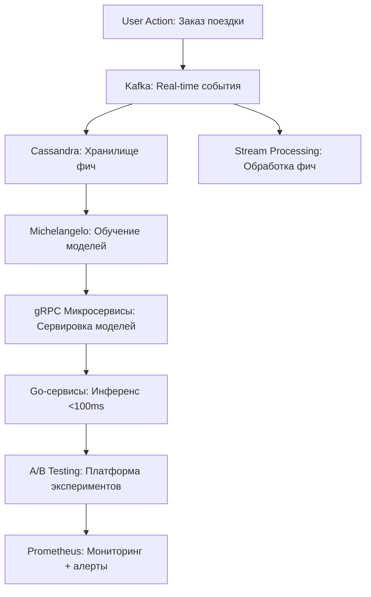
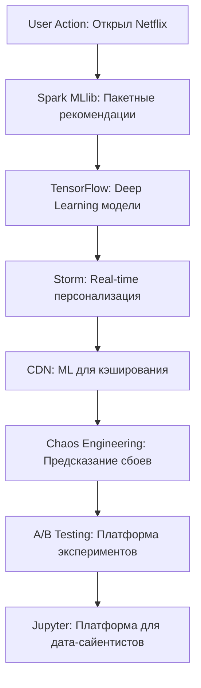
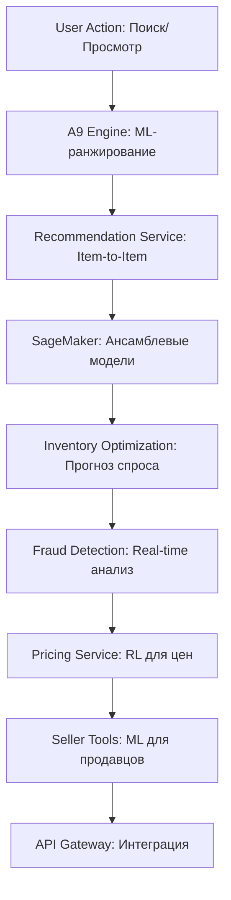
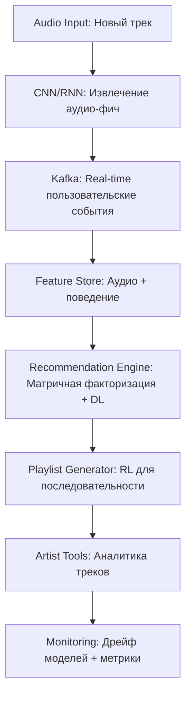
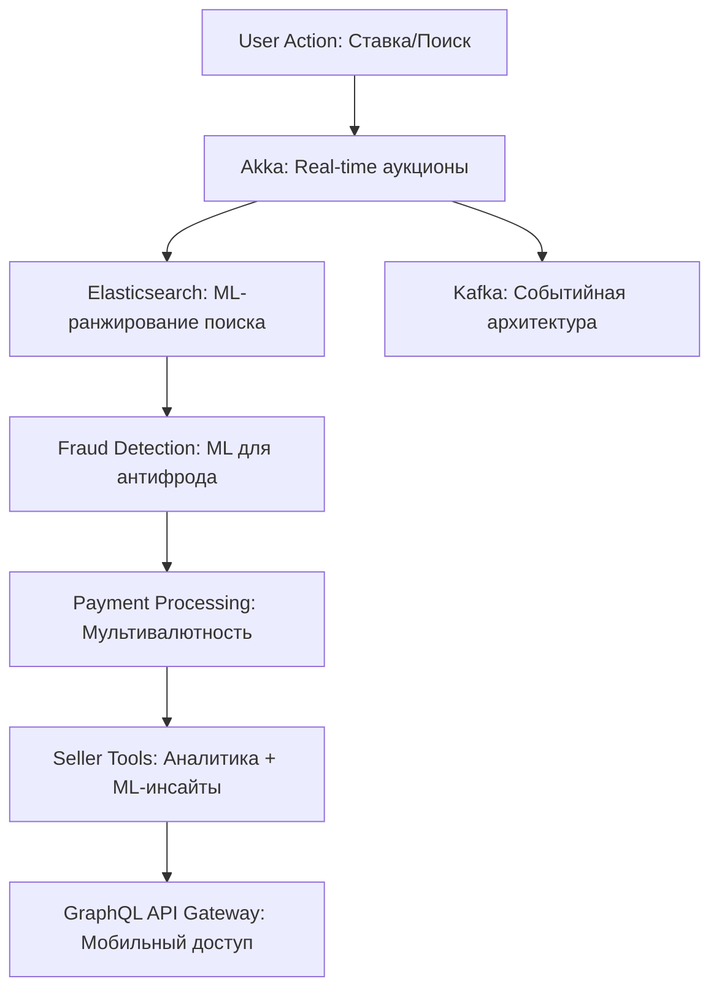
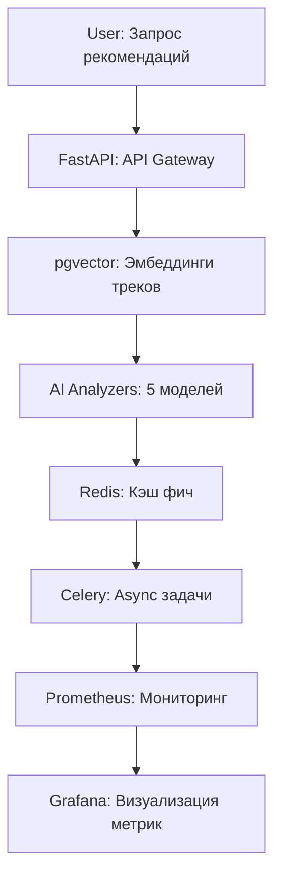
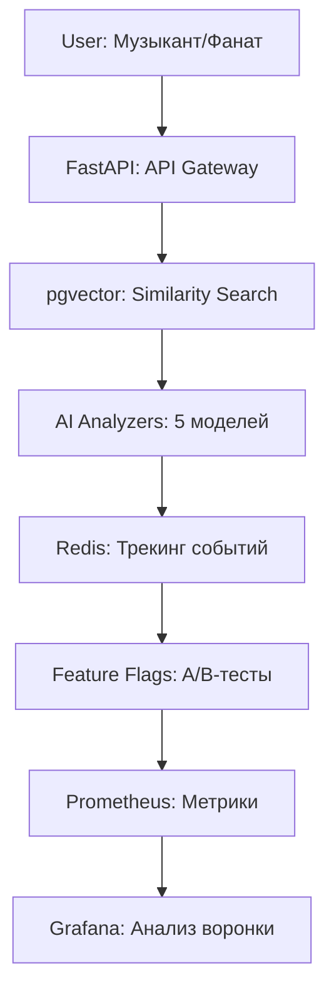
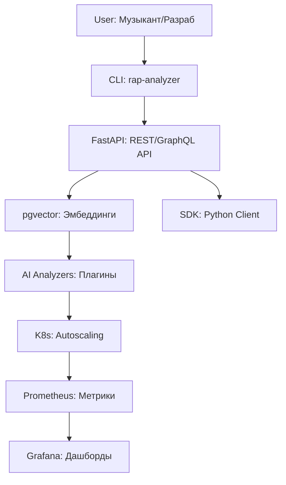
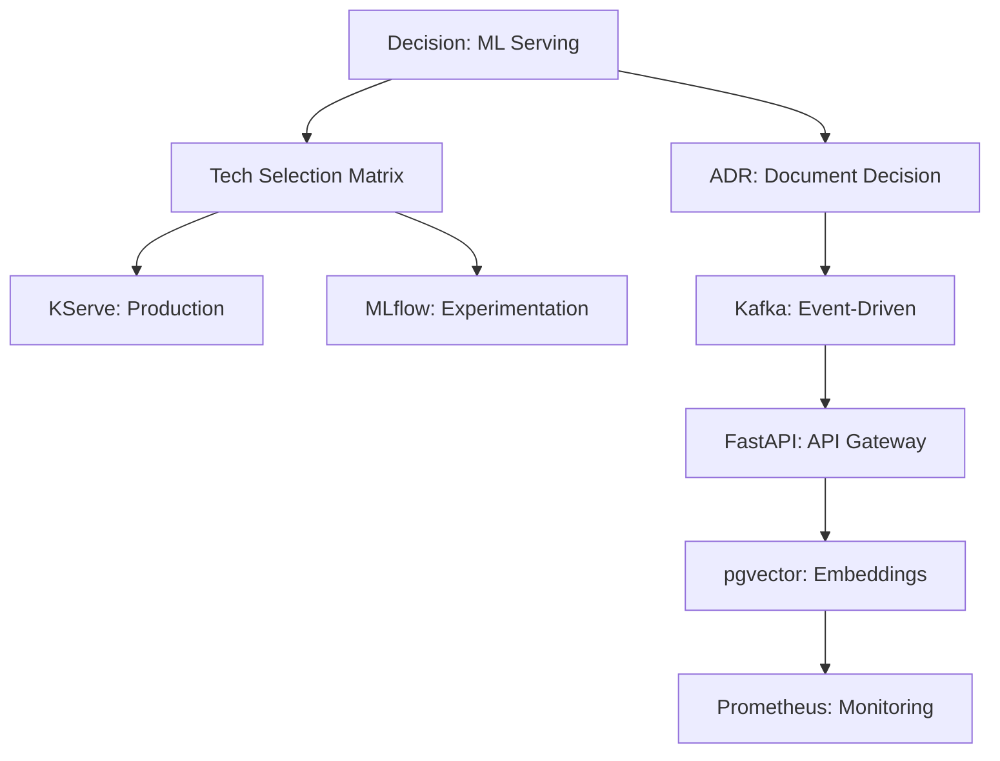
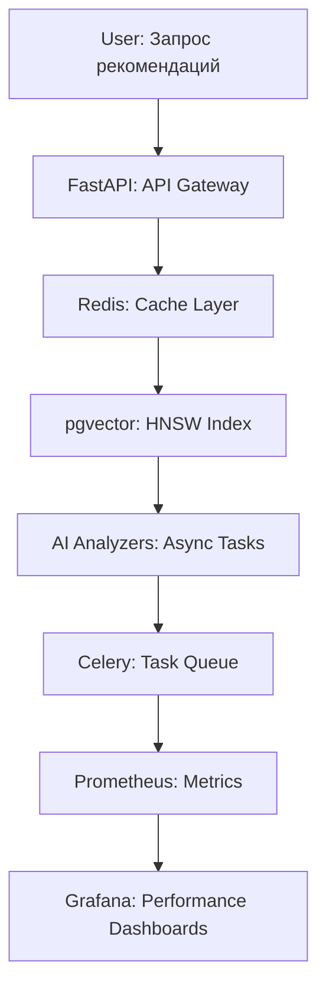

# 🧠 Complete Engineering Mindset Notebook - Software Architect & ML Platform Engineer


> **Цель:** Думать как Senior Software Engineer и ML Platform Engineer, который создаёт масштабируемые, устойчивые системы для крупных продуктов (маркетплейсы, такси, стриминговые сервисы, AI-платформы). Фокус на системном мышлении, архитектуре и решении проблем, а не на конкретном технологическом стеке.
---

## 📊 Фреймворк решения проблем

### 🎯 Что такое Problem Solving для Software Engineer/Архитектора?

**Problem Solving** — это не просто "починить баг" или "решить задачу", а системный подход к сложным проблемам, учитывающий бизнес-контекст, технические компромиссы и долгосрочную устойчивость. Это навык, который делает из кодера инженера: ты создаёшь масштабируемые, поддерживаемые решения, приносящие реальную ценность.

**Для ML Platform Engineer** это включает:
- **🔍 Анализ задачи**: Разложить проблему до сути — понять, почему она возникла, какие есть ограничения (бюджет, время, ресурсы, данные), цели (метрики успеха: точность, латентность, пропускная способность, стоимость) и стейкхолдеры (дата-сайентисты, продуктовые команды, конечные пользователи).

- **🏗️ Разработка стратегии**: Выбрать архитектуру (пакетная vs потоковая обработка, облако vs on-premise, монолит vs микросервисы), алгоритмы (классический ML vs глубокое обучение vs LLM) и инфраструктуру с учётом масштабируемости, дрейфа моделей и воспроизводимости.

- **⚡ Оптимизация**: Балансировать компромиссы — точность vs латентность, сложность модели vs интерпретируемость, стоимость обучения vs скорость инференса. Использовать профилирование, A/B-тестирование и бенчмаркинг для решений на основе данных.

- **🧩 Декомпозиция**: Разбить ML-пайплайн на компоненты: сбор данных → инжиниринг фич → обучение → сервировка → мониторинг. Каждый с независимым масштабированием и ответственностью.

- **🐛 Отладка и тестирование**: Не только код, но и модели, данные, инфраструктура. Включать валидацию данных, тестирование моделей, теневые деплои и хаос-инжиниринг для ML-систем.

- **💡 Креативность и инновации**: Искать нестандартные подходы (например, федеративное обучение для приватности, AutoML для эффективности) и учиться на ошибках через пост-мортемы и логи экспериментов.

- **📈 Измерение и итерация**: Определять бизнес-метрики (конверсия, выручка) и технические метрики (точность модели, латентность системы), мониторить дрейф моделей и ухудшение производительности.

**Пример в контексте:** Тебе ставят задачу "спроектировать систему рекомендаций для 10M пользователей". Не просто "бери collaborative filtering" — думай о: проблеме холодного старта, обновлениях в реальном времени vs пакетных, дизайне хранилища фич, версионировании моделей, инфраструктуре A/B-тестирования и оптимизации затрат (вычисления vs хранилище vs API-вызовы).

**Инсайт:** Problem solving — это мышление "от начала до конца" с фокусом на воздействие. В ML это значит думать от качества данных до бизнес-KPI. "Стек кандидата — не главное" означает, что если ты мастер в PyTorch, но нужен TensorFlow — ты быстро разберёшься. Главное — принципы (компромисс между смещением и дисперсией, распределённые системы, лучшие практики софтверной инженерии).

---

# 🏢 Реальные Кейсы: Учимся на Гигантах

## 🚗 Uber: Real-time ML Platform & Dispatch System

**Зачем это, бро?**  
Uber — это про то, как строить ML-платформу, которая мэтчит миллионы поездок в реальном времени, не тормозит и не ломается даже в час пик. 😎 Их подход идеально ложится на твой rap analyzer, если ты хочешь сделать рекомендации треков с latency <200ms и масштабом под миллионы пользователей. Учимся у гигантов, чтобы твой проект взлетел до уровня enterprise! 🌟

**Проблема:**  
Как в реальном времени мэтчить 15M+ поездок в день? Нужно:  
- ML для динамического ценообразования (surge pricing).  
- Точные предсказания ETA (время прибытия).  
- Выявление мошенничества (фэйковые аккаунты).  
- Обработка пиковых нагрузок (утренний час пик в NYC).  
- Всё с latency <1s и 99.9% uptime.  

**Как Uber это решает?**  
Их ML-платформа — это как швейцарский нож для реального времени. Вот как они устроены:

### 🏗️ Архитектура ML-платформы


- **Хранилище фич**: Kafka + Cassandra для реального времени (логи поездок, локация, поведение юзеров).  
- **Обучение моделей**: Платформа Michelangelo (Spark + Horovod) для тренировки моделей.  
- **Сервировка моделей**: gRPC-микросервисы с реестром моделей для быстрого деплоя.  
- **A/B-тестирование**: Платформа экспериментов сравнивает модели на лету.  
- **Инференс**: Go-сервисы для предсказаний с latency <100ms.  
- **Мониторинг**: Prometheus + алерты на дрейф моделей и бизнес-метрики.  
- **Пайплайн данных**: Потоковая обработка для фич (например, паттерны трафика).

**Зачем тебе это знать?**  
Эта архитектура — шаблон для любой real-time ML-системы. Твой rap analyzer может использовать такие же паттерны, чтобы выдавать рекомендации треков за миллисекунды, а не секунды. 🚀

### 🔥 Как Uber решает инженерные проблемы
- **Анализ**: Разбили систему на подсистемы с чёткими SLA:  
  - Ценообразование: <100ms.  
  - ETA: <200ms.  
  - Мошенничество: <500ms.  
- **Декомпозиция**: Фичи (локация, время) отделены от инференса, чтобы каждую часть можно было масштабировать отдельно.  
- **Оптимизация**:  
  - Кэшируют модели в памяти для скорости.  
  - Предварительно считают фичи (например, средний трафик по городу).  
  - Используют географический шардинг (NYC отдельно от SF).  
- **Креативность**:  
  - Многорукий бандит для экспериментов с ценами (тестируют разные алгоритмы).  
  - Контекстные фичи (погода, события в городе).  
- **Измерение**:  
  - Технические метрики: latency, точность моделей.  
  - Бизнес-метрики: конверсия заказов, выручка за поездку.  

**Пример из жизни**:  
Uber заметил, что их ETA-модель начала выдавать фигню в час пик. Они профилировали, нашли узкое место в базе (Cassandra тормозила), добавили read replicas и кэш в Redis — latency упала с 500ms до 150ms. 💪

### 🧠 Что ты можешь взять для своего rap analyzer
- **Потоковая обработка**: Используй Kafka или Redis Streams для real-time фич (например, что юзер слушал 5 минут назад).  
- **Версионирование моделей**: Сохраняй версии своих 5 AI-анализаторов, чтобы откатиться, если новая модель косячит.  
- **Хранилище фич**: Строй feature store, чтобы повторно использовать эмбеддинги треков для разных моделей.  
- **Мульти-модельный инференс**: Комбинируй свои анализаторы (жанр, настроение, темп) для мощных рекомендаций.  

**Попробуй сам**:  
1. Возьми свой rap analyzer.  
2. Добавь Redis для кэширования топ-100 треков (чтобы не дёргать pgvector каждый раз).  
3. Замерь latency до и после — напиши, насколько быстрее стало!  

### 🛠️ Код: Uber-style для твоего rap analyzer
```python
from redis import Redis
from your_rap_analyzer import FeatureStore, ModelRegistry, Monitor

class MusicRecommendationPlatform:
    def __init__(self):
        self.feature_store = FeatureStore(redis=Redis(host='localhost'))  # Real-time фичи
        self.model_registry = ModelRegistry()  # Версионирование моделей
        self.monitor = Monitor()  # Мониторинг latency и дрейфа
        
    async def get_recommendations(self, user_id: str, context: dict):
        # 1. Дёргаем фичи юзера (например, последние треки)
        features = await self.feature_store.get_features(user_id, context)
        
        # 2. Выбираем модель через A/B-тест
        model_variant = self.get_ab_test_variant(user_id)
        model = self.model_registry.get_model(model_variant)
        
        # 3. Делаем предсказание с мониторингом
        with self.monitor.track_latency("recommendation"):
            recommendations = await model.predict(features)
            
        return recommendations
    
    def get_ab_test_variant(self, user_id: str) -> str:
        """Простой A/B-тест: делим юзеров на группы"""
        return "model_v1" if hash(user_id) % 2 == 0 else "model_v2"
```

**Зачем этот код?**  
- **Feature Store**: Хранит поведение юзеров (что слушали, лайки) в Redis для скорости.  
- **Model Registry**: Позволяет деплоить новые версии твоих анализаторов без даунтайма.  
- **A/B-тест**: Проверяй, какая модель даёт лучше рекомендации (например, по кликам).  
- **Мониторинг**: Следи за latency и качеством рекомендаций в Prometheus.  

**Следующий шаг для тебя**:  
- Настрой Redis локально (`docker run -d redis`).  
- Попробуй закешировать результаты similarity search для 100 треков.  
- Сравни latency с pgvector и без кэша — напиши, что получилось!  

### 📈 Что дальше изучать
- **Потоковая обработка**: Погугли Apache Kafka или Redis Streams — это база для real-time рекомендаций.  
- **Версионирование моделей**: Чекни MLflow или Kubeflow для управления твоими AI-анализаторами.  
- **Feature Store**: Посмотри Feast или Hopsworks — они помогут хранить и переиспользовать фичи.  
- **Мониторинг**: Настрой Prometheus + Grafana для трекинга latency и дрейфа моделей.  

**Pro Tip**: Добавь асинхронную обработку и мониторинг, и ты готов к масштабу 1M треков в день! 😎

## 📺 Netflix: ML-Powered Content Platform

**Зачем это, бро?**  
Netflix — это мастер-класс по персонализации для 200M+ юзеров и доставке контента без лагов. 😎 Они строят ML-платформу, которая не только рекомендует фильмы, но и оптимизирует видео, экспериментирует с тысячами A/B-тестов и держит буферизацию <1%. Твой rap analyzer может взять их подходы, чтобы кастомизировать треки под юзеров и масштабироваться до миллионов запросов в день! 🎵

**Проблема:**  
Как персонализировать контент для 200M+ юзеров и при этом:  
- Доставлять 125M+ часов видео в день без тормозов.  
- Проводить 1000+ A/B-тестов в год.  
- Оптимизировать кодирование видео и выбор обложек с помощью ML.  
- Держать буферизацию <1% и latency на уровне миллисекунд.  

**Как Netflix это решает?**  
Их ML-платформа — это комбо из рекомендаций, оптимизации и отказоустойчивости. Вот как всё устроено:

### 🏗️ Архитектура ML-платформы


- **Рекомендательный движок**: Spark MLlib для пакетных вычислений + TensorFlow для глубокого обучения.  
- **Оптимизация контента**: ML выбирает обложки и кодирует видео для экономии трафика.  
- **Платформа экспериментов**: Кастомный фреймворк для 1000+ A/B-тестов в год.  
- **CDN-интеллект**: ML предсказывает, какие фильмы кэшировать ближе к юзеру.  
- **Real-time персонализация**: Storm обрабатывает действия юзеров (клики, паузы) для мгновенных рекомендаций.  
- **Хаос-инжиниринг**: ML предсказывает сбои и авто-восстанавливает систему.  
- **Платформа для дата-сайентистов**: Jupyter-ноутбуки + MLOps для 100+ команд.  

**Зачем тебе это знать?**  
Netflix показывает, как интегрировать ML с продакшен-системами (CDN, биллинг) и как делать платформу, которой пользуются сотни дата-сайентистов. Твой rap analyzer может стать такой же self-service платформой для музыки! 🚀

### 🔥 Принципы инженерии Netflix
- **Системное мышление**: ML не живёт в вакууме — он работает с CDN, биллингом и контент-командами.  
  *Пример*: Твои 5 AI-анализаторов должны интегрироваться с API и мониторингом.  
- **Продуктовая инженерия**: Фокус на бизнесе — удержание юзеров важнее точности модели.  
  *Пример*: В analyzer’е мерь не только точность, но и как часто юзеры сохраняют треки.  
- **Платформенное мышление**: Инструменты для самообслуживания — дата-сайентисты сами деплоят модели.  
  *Пример*: Сделай CLI для твоего analyzer’а, чтобы другие могли запускать анализ.  
- **Ответственность**: Инженеры отвечают за весь цикл — от эксперимента до продакшена.  
  *Пример*: Настрой мониторинг в analyzer’е, чтобы ловить дрейф моделей.  

### 🧠 Инсайты по решению проблем
- **Холодный старт**: Новым юзерам показывают популярные треки или контент-ориентированные рекомендации.  
  *Пример*: Если юзер новый, твой analyzer может предложить топ-10 треков по жанру.  
- **Многоцелевая оптимизация**: Баланс между релевантностью, разнообразием и новизной.  
  *Пример*: Не зацикливайся на точности — добавляй в рекомендации неожиданные треки.  
- **Инжиниринг фич**: Комбинируй real-time (устройство, время) и исторические данные (просмотры).  
  *Пример*: В analyzer’е учитывай, что юзер слушал утром vs вечером.  
- **Ансамбль моделей**: Миксуй алгоритмы для надёжности.  
  *Пример*: Комбинируй свои 5 анализаторов с popularity-based моделью.  

**Пример из жизни**:  
Netflix заметил, что юзеры уходят из-за однотипных рекомендаций. Они добавили diversity score в модель (чтобы не только боевики предлагать) — удержание выросло на 5%. Ты можешь сделать то же в analyzer’е: мешай жанры, чтобы юзеры открывали новое! 😎

### 🛠️ Как применить к твоему rap analyzer
- **Ансамбль моделей**: Используй свои 5 AI-анализаторов + модель популярности для новых юзеров.  
- **A/B-тестирование**: Тестируй разные алгоритмы рекомендаций (например, по настроению vs по темпу).  
- **Real-time фичи**: Лови действия юзеров (лайки, скипы) через Redis или Kafka.  
- **Хаос-инжиниринг**: Добавь тесты, чтобы проверить, как analyzer держит нагрузку.  

**Попробуй сам**:  
1. Возьми свой rap analyzer.  
2. Добавь простую popularity-based модель (например, топ-10 треков по прослушиваниям).  
3. Сравни, как она работает для новых юзеров vs твои AI-анализаторы. Замерь, сколько юзеры сохраняют треков. Напиши, что получилось! 🚀

### 💻 Код: Netflix-style для твоего rap analyzer
```python
from typing import List, Dict
from your_rap_analyzer import CollaborativeFilteringModel, ContentBasedModel, PopularityModel

class MusicStreamingPlatform:
    def __init__(self):
        # Ансамбль моделей, как у Netflix
        self.recommendation_engine = MultiModelEnsemble([
            CollaborativeFilteringModel(),  # Похожие юзеры
            ContentBasedModel(),           # Твои AI-анализаторы
            PopularityModel()              # Фоллбэк для новых юзеров
        ])
        self.ab_testing = NetflixStyleExperimentation()
        self.monitor = Monitor()  # Мониторинг метрик
        
    async def personalize_homepage(self, user_id: str) -> Dict:
        # Многоцелевая оптимизация
        with self.monitor.track_latency("recommendation"):
            recommendations = await self.recommendation_engine.predict(
                user_id=user_id,
                objectives=['relevance', 'diversity', 'novelty']
            )
        
        # A/B-тест для layout’а
        layout = self.ab_testing.get_homepage_variant(user_id)
        
        return {
            'recommendations': recommendations,
            'layout': layout
        }

class MultiModelEnsemble:
    def __init__(self, models: List):
        self.models = models
    
    async def predict(self, user_id: str, objectives: List[str]) -> List:
        # Комбинируем предсказания
        results = []
        for model in self.models:
            model_results = await model.predict(user_id)
            results.extend(model_results)
        
        # Применяем бизнес-правила (diversity, novelty)
        return self.rerank_results(results, objectives)

    def rerank_results(self, results: List, objectives: List[str]) -> List:
        # Пример: добавляем diversity через сортировку
        return sorted(results, key=lambda x: self.score_result(x, objectives))[:10]

    def score_result(self, result, objectives):
        # Простая логика для diversity и novelty
        return sum(result.get(obj, 0) for obj in objectives)
```

**Зачем этот код?**  
- **Ансамбль моделей**: Комбинирует твои 5 AI-анализаторов с моделью популярности для надёжных рекомендаций.  
- **A/B-тестирование**: Проверяй разные варианты главной страницы (например, по жанрам или настроению).  
- **Мониторинг**: Следи за latency и качеством рекомендаций в реальном времени.  
- **Real-time**: Асинхронный код для скорости, как у Netflix.  

**Следующий шаг для тебя**:  
- Настрой локальный Redis (`docker run -d redis`) для хранения user actions (лайки, скипы).  
- Добавь popularity-based модель (например, топ треков по прослушиваниям).  
- Замерь, как она влияет на retention (сколько юзеры сохраняют треков).  

### 📈 Что дальше изучать
- **Рекомендательные системы**: Погугли Netflix’s RecSys papers — особенно про многорукие бандиты.  
- **Feature Engineering**: Чекни Feast для создания feature store (хранить лайки и прослушивания).  
- **Хаос-инжиниринг**: Посмотри Chaos Monkey от Netflix — попробуй сломать свой analyzer и починить.  
- **MLOps**: Изучи MLflow для управления экспериментами и деплоя моделей.  

**Pro Tip**: Добавь real-time фичи и A/B-тесты, и ты готов к платформе на миллионы юзеров! 😎


## 🛒 Amazon: E-commerce ML Platform

**Зачем это, бро?**  
Amazon — это король масштаба: 2.5B+ посещений в день, миллиарды поисков, рекомендации для миллионов продавцов, и всё это без сбоев. 😎 Их подход — это про то, как строить ML-платформу, которая работает как швейцарские часы, экономит бабки и даёт API для всех. Твой rap analyzer может взять их паттерны, чтобы стать API-first платформой для музыкальных рекомендаций с охватом в миллионы юзеров! 🎵

**Проблема:**  
Как обработать 2.5B+ посещений в день и при этом:  
- Ранжировать миллиарды поисков с помощью ML.  
- Рекомендовать продукты для миллионов продавцов.  
- Оптимизировать инвентарь и цепочку поставок.  
- Ловить мошенников в реальном времени.  
- Держать latency на уровне миллисекунд и затраты под контролем.  

**Как Amazon это решает?**  
Их ML-платформа — это набор микросервисов, которые делают всё: от поиска до борьбы с фродами. Вот как устроено:

### 🏗️ Архитектура ML-платформы


- **Поиск и ранжирование**: Движок A9 с глубоким обучением для релевантных результатов.  
- **Рекомендации**: Item-to-item коллаборативная фильтрация + нейронки.  
- **Оптимизация инвентаря**: ML прогнозирует спрос, чтобы склады не пустовали.  
- **Обнаружение мошенничества**: Ансамблевые модели в SageMaker ловят фрод.  
- **Динамическое ценообразование**: Обучение с подкреплением (RL) для цен.  
- **Цепочка поставок**: Предиктивная аналитика для логистики.  
- **Платформа для продавцов**: ML-инструменты для сторонних продавцов (аналитика, инсайты).  

**Зачем тебе это знать?**  
Amazon показывает, как строить платформу, где каждый сервис масштабируется отдельно, а API — это сердце системы. Твой rap analyzer может стать такой же API-first платформой для музыкальных рекомендаций и аналитики! 🚀

### 🔥 Инсайты Amazon Engineering
- **Платформа в приоритете**: SageMaker родился из внутренних нужд (dogfooding) — они сами юзают то, что строят.  
  *Пример*: Сделай свой analyzer платформой, чтобы другие могли деплоить свои анализаторы через твой API.  
- **API-ориентированность**: Всё доступно через API — для разработчиков, продавцов, партнёров.  
  *Пример*: Добавь в analyzer REST API, чтобы музыканты могли анализировать треки.  
- **Микросервисы**: Каждый ML-сервис (поиск, рекомендации, фрод) живёт отдельно и масштабируется сам.  
  *Пример*: Раздели свои 5 AI-анализаторов на микросервисы в Docker.  
- **Оптимизация затрат**: Используют спотовые инстансы, автоскейлинг и серверлесс для ML.  
  *Пример*: Настрой K8s autoscaling для analyzer’а, чтобы не жрать лишние ресурсы.  

**Пример из жизни**:  
Amazon заметил, что их поисковый движок A9 выдавал нерелевантные результаты для редких запросов. Они добавили контекстные фичи (история юзера, гео) и переключились на нейронки — конверсия выросла на 3%. Ты можешь сделать то же: добавь в analyzer контекст (жанр, настроение), чтобы поиск треков был точнее! 😎

### 🛠️ Как применить к твоему rap analyzer
- **API-first**: Сделай REST API для анализа треков и рекомендаций.  
- **Микросервисы**: Раздели analyzer на сервисы (например, один для жанров, другой для настроения).  
- **Оптимизация затрат**: Используй K8s autoscaling, чтобы твой analyzer не жрал лишние ресурсы.  
- **Антифрод**: Добавь проверку данных (например, лови кривые треки до анализа).  

**Попробуй сам**:  
1. Возьми свой rap analyzer.  
2. Создай REST API эндпоинт для similarity search (например, `/api/tracks/similar`).  
3. Замерь, сколько запросов он выдерживает без K8s и с autoscaling. Напиши, что получилось! 🚀

### 💻 Код: Amazon-style для твоего rap analyzer
```python
from fastapi import FastAPI
from your_rap_analyzer import SearchRankingService, RecommendationService, FraudDetectionService

app = FastAPI()

class MarketplaceMLPlatform:
    def __init__(self):
        self.search_ranking = SearchRankingService()  # Поиск по трекам
        self.recommendation_engine = RecommendationService()  # Рекомендации
        self.fraud_detection = FraudDetectionService()  # Проверка данных
        self.monitor = Monitor()  # Мониторинг метрик
        
    async def process_user_session(self, session_data: dict) -> dict:
        # Мультисервисный ML-пайплайн
        with self.monitor.track_latency("session_processing"):
            # Поиск по запросу
            search_results = await self.search_ranking.rank_products(
                query=session_data["search_query"],
                user_context=session_data["user_profile"]
            )
            
            # Рекомендации по просмотренным трекам
            recommendations = await self.recommendation_engine.get_related_items(
                viewed_items=session_data["viewed_tracks"]
            )
            
            # Проверка на фрод (например, кривые треки)
            fraud_score = await self.fraud_detection.score_session(session_data)
        
        return {
            "search_results": search_results,
            "recommendations": recommendations,
            "fraud_risk": fraud_score
        }

# FastAPI эндпоинт
@app.post("/api/session")
async def process_session(session_data: dict):
    platform = MarketplaceMLPlatform()
    return await platform.process_user_session(session_data)
```

**Зачем этот код?**  
- **API-first**: FastAPI эндпоинт делает твой analyzer доступным для других (музыкантов, лейблов).  
- **Микросервисы**: Каждый сервис (поиск, рекомендации, антифрод) можно масштабировать отдельно.  
- **Мониторинг**: Лови latency и ошибки через Prometheus.  
- **Антифрод**: Проверяй треки перед анализом, чтобы не тратить ресурсы на мусор.  

**Следующий шаг для тебя**:  
- Настрой FastAPI локально (`pip install fastapi uvicorn`).  
- Создай эндпоинт `/api/tracks/similar` для similarity search через pgvector.  
- Замерь latency и RPS (requests per second) с помощью `wrk` или `locust`.  

### 📈 Что дальше изучать
- **API Design**: Чекни AWS API Gateway — как делать REST API для масштаба.  
- **Микросервисы**: Изучи Docker Compose и K8s для разделения analyzer’а на сервисы.  
- **Оптимизация затрат**: Погугли AWS Spot Instances и serverless (например, Lambda).  
- **Антифрод**: Посмотри SageMaker для ансамблевых моделей — можно применить для проверки треков.  

**Pro Tip**: Добавь API Gateway и autoscaling в K8s, и ты готов к миллиардам запросов! 😎


## 🎵 Spotify: Audio ML Platform

**Зачем это, бро?**  
Spotify — это короли музыкального ML, которые анализируют 70M+ треков и кастомизируют рекомендации для 180M+ юзеров. 😎 Их платформа — идеальный референс для твоего rap analyzer, потому что ты уже работаешь с аудио-фичами и pgvector. Хочешь построить систему, которая генерит плейлисты, рекомендует треки в реальном времени и масштабируется до миллионов? Учись у Spotify и качай свой проект до их уровня! 🎉

**Проблема:**  
Как обрабатывать 70M+ треков и 180M+ активных юзеров? Нужно:  
- Анализировать аудио-фичи (жанр, темп, настроение).  
- Генерировать персонализированные плейлисты.  
- Рекомендовать треки на основе аудио + поведения юзеров.  
- Делать инференс с latency <200ms.  
- Поддерживать новых артистов (cold start).  

**Как Spotify это решает?**  
Их ML-платформа — это комбо аудио-анализа, рекомендаций и real-time магии. Вот как всё устроено:

### 🏗️ Архитектура ML-платформы


- **Извлечение аудио-фич**: CNN для спектрограмм, RNN для временных паттернов (темп, ритм).  
- **Понимание музыки**: Классификация жанров, настроения, анализ темпа.  
- **Рекомендательный движок**: Матричная факторизация + глубокое обучение + аудио-эмбеддинги.  
- **Генерация плейлистов**: Обучение с подкреплением (RL) для оптимального порядка треков.  
- **Real-time персонализация**: Kafka для потоков данных + ML-инференс.  
- **Инструменты для артистов**: ML предсказывает успех треков для музыкантов.  

**Зачем тебе это знать?**  
Spotify — это прям твой use case! Твои 5 AI-анализаторов и pgvector — уже фундамент для Spotify-style платформы. Их подходы помогут тебе добавить real-time рекомендации, плейлисты и масштабировать analyzer до миллионов треков. 🚀

### 🔥 Как Spotify решает инженерные проблемы
- **Multi-modal ML**: Комбинируют аудио-фичи (твои анализаторы!), поведение юзеров (лайки, скипы) и метаданные (жанр, артист).  
  *Пример*: Твой analyzer может миксовать эмбеддинги треков с историей прослушиваний.  
- **Scalable Feature Engineering**: Обрабатывают петабайты аудио эффективно.  
  *Пример*: Используй batch processing для анализа новых треков в analyzer’е.  
- **Real-time Inference**: Рекомендации за <200ms во время прослушивания.  
  *Пример*: Настрой async инференс для твоих анализаторов, чтобы не тормозить API.  
- **Cold Start**: Для новых треков/артистов используют content-based подход.  
  *Пример*: Если трек новый, твой analyzer может искать похожие по эмбеддингам.  

**Пример из жизни**:  
Spotify заметил, что новые юзеры быстро уходят из-за слабых рекомендаций. Они добавили content-based модель (на основе аудио-фич) для cold start — retention вырос на 7%. Ты можешь сделать то же: если юзер новый, предлагай треки по жанру или настроению из твоего analyzer’а! 😎

### 🛠️ Как применить к твоему rap analyzer
- **Multi-modal ML**: Комбинируй свои 5 AI-анализаторов с user behavior (например, что юзер лайкнул).  
- **Feature Store**: Храни аудио-эмбеддинги и поведение юзеров в Redis или PostgreSQL.  
- **Real-time рекомендации**: Используй Kafka или Redis Streams для лайков/скипов в реальном времени.  
- **Плейлисты**: Добавь RL или простую сортировку для генерации плейлистов.  

**Попробуй сам**:  
1. Возьми свой rap analyzer.  
2. Добавь content-based модель для новых треков (например, поиск по жанру через pgvector).  
3. Замерь, как она работает для новых треков vs твои 5 анализаторов. Сколько юзеры сохраняют треков? Напиши, что получилось! 🚀

### 💻 Код: Spotify-style для твоего rap analyzer
```python
from typing import Dict, List
from your_rap_analyzer import YourFiveAIAnalyzers, PostgreSQLVectorStore
from redis import Redis
from kafka import KafkaConsumer

class MusicAIStudioPlatform:
    def __init__(self):
        # Твои текущие компоненты
        self.audio_analyzers = YourFiveAIAnalyzers()  # 5 AI анализаторов
        self.vector_db = PostgreSQLVectorStore()      # pgvector
        self.feature_store = Redis(host='localhost')   # Хранилище фич
        
        # Spotify-style компоненты
        self.recommendation_engine = MultiModalRecommender()
        self.playlist_generator = PlaylistML()
        self.monitor = Monitor()

    async def analyze_and_recommend(self, track_id: str, user_context: Dict) -> Dict:
        # Анализируем трек с помощью твоих анализаторов
        with self.monitor.track_latency("audio_analysis"):
            audio_features = await self.audio_analyzers.analyze(track_id)
        
        # Поиск похожих треков через pgvector
        similar_tracks = await self.vector_db.find_similar(
            embeddings=audio_features["embeddings"],
            limit=50
        )
        
        # Персонализированные рекомендации
        with self.monitor.track_latency("recommendation"):
            personalized_recs = await self.recommendation_engine.rank(
                candidates=similar_tracks,
                user_context=user_context,
                audio_features=audio_features
            )
        
        # Генерация плейлиста
        playlist = await self.playlist_generator.generate(
            tracks=personalized_recs,
            user_context=user_context
        )
        
        return {
            "analysis": audio_features,
            "recommendations": personalized_recs,
            "playlist": playlist
        }

class MultiModalRecommender:
    async def rank(self, candidates: List, user_context: Dict, audio_features: Dict) -> List:
        # Комбинируем аудио и поведение юзера
        scores = []
        for track in candidates:
            score = self.calculate_score(track, user_context, audio_features)
            scores.append((track, score))
        
        # Сортируем по релевантности
        return [track for track, _ in sorted(scores, key=lambda x: x[1], reverse=True)[:10]]

    def calculate_score(self, track: Dict, user_context: Dict, audio_features: Dict) -> float:
        # Пример: микс аудио-фич и user behavior
        genre_match = 0.5 if track["genre"] in user_context["preferred_genres"] else 0
        mood_match = 0.3 if track["mood"] == audio_features["mood"] else 0
        return genre_match + mood_match + track["popularity"]
```

**Зачем этот код?**  
- **Multi-modal ML**: Комбинирует твои 5 AI-анализаторов с user behavior для точных рекомендаций.  
- **Feature Store**: Redis хранит лайки/скипы юзеров для скорости.  
- **Real-time**: Асинхронный инференс для latency <200ms.  
- **Плейлисты**: Генерирует плейлисты, как Spotify, с учётом жанра и настроения.  

**Следующий шаг для тебя**:  
- Настрой Redis локально (`docker run -d redis`).  
- Добавь простую content-based модель (например, поиск по жанру через pgvector).  
- Замерь, как она влияет на retention (сколько треков юзеры добавляют в плейлисты).  

### 📈 Что дальше изучать
- **Аудио-анализ**: Погугли Spotify’s audio feature papers — особенно про CNN и RNN для спектрограмм.  
- **Feature Store**: Чекни Feast или Hopsworks для хранения аудио-фич и поведения юзеров.  
- **Real-time**: Изучи Kafka Streams для обработки лайков/скипов в реальном времени.  
- **Плейлисты**: Погугли RL для playlist generation (например, Spotify’s approach).  

**Pro Tip**: Добавь real-time фичи через Kafka/Redis и плейлист-генерацию, и ты готов к платформе на 180M юзеров! 


## 🛍️ eBay: Auction & Marketplace Platform

**Зачем это, бро?**  
eBay — это про аукционы в реальном времени, релевантный поиск и защиту от мошенников для миллионов юзеров. 😎 Их подход идеально подходит, чтобы твой rap analyzer стал надёжной платформой: обрабатывал кучу запросов, держал данные в порядке и не давал системе упасть. Хочешь, чтобы твой проект масштабировался до миллионов треков и был пуленепробиваемым? Учись у eBay и качай свой код до enterprise-уровня! 💪

**Проблема:**  
Как управлять миллионами аукционов в реальном времени и при этом:  
- Обеспечивать релевантный поиск для покупателей.  
- Ловить мошенников (фэйковые ставки, аккаунты).  
- Обрабатывать глобальные платежи (мультивалютность, стандарты).  
- Давать продавцам аналитику для роста продаж.  
- Держать latency <200ms и 99.9% uptime.  

**Как eBay это решает?**  
Их платформа — это микс real-time движка, ML и событийной архитектуры. Вот как всё устроено:

### 🏗️ Архитектура платформы


- **Real-time аукционы**: Akka для конкурентных торгов (миллионы ставок без лагов).  
- **Поиск и обнаружение**: Elasticsearch + ML для релевантных результатов.  
- **Доверие и безопасность**: ML-модели для обнаружения фрода и оценки рисков.  
- **Глобальные платежи**: Поддержка мультивалютности и стандартов (PCI DSS).  
- **Инструменты для продавцов**: ML-инсайты (например, прогноз спроса на товары).  
- **API-шлюз**: GraphQL для мобильных приложений и интеграций.  

**Зачем тебе это знать?**  
eBay показывает, как строить платформу, которая держит миллионы транзакций, не ломается и защищает данные. Твой rap analyzer может взять их событийную архитектуру и антифрод, чтобы стать надёжной платформой для музыкальных лейблов или артистов! 🚀

### 🔥 Ключевые инсайты eBay Engineering
- **Консистентность vs доступность**: Используют эвентуальную консистентность (CAP теорема) для ставок, чтобы система не падала.  
  *Пример*: В analyzer’е можно сохранять лайки юзеров асинхронно, чтобы API не тормозил.  
- **Полиглотная персистентность**: Разные базы для разных задач (Elasticsearch для поиска, Cassandra для событий).  
  *Пример*: Используй pgvector для эмбеддингов и Redis для лайков/скипов.  
- **Событийно-ориентированная архитектура**: События (ставки, покупки) запускают кучу downstream-сервисов.  
  *Пример*: Настрой Kafka, чтобы лайк трека в analyzer’е триггерил рекомендации.  

**Пример из жизни**:  
eBay заметил, что фродовые аккаунты делали фэйковые ставки, перегружая систему. Они добавили ML-модель на SageMaker для real-time детекции — фрод упал на 80%, а latency остался <200ms. Ты можешь сделать то же: добавить проверку треков в analyzer’е, чтобы ловить битые файлы до анализа! 😎

### 🛠️ Как применить к твоему rap analyzer
- **Событийная архитектура**: Используй Kafka или Redis Streams для обработки лайков/скипов в реальном времени.  
- **Антифрод**: Проверяй треки перед анализом (например, битые файлы или спам).  
- **Поиск**: Добавь Elasticsearch для быстрого поиска по жанру/настроению.  
- **API-шлюз**: Сделай GraphQL API для мобильных клиентов.  

**Попробуй сам**:  
1. Возьми свой rap analyzer.  
2. Добавь простую проверку треков (например, валидация формата или размера файла).  
3. Замерь, сколько времени экономится, если отсеивать битые треки до анализа. Напиши, что получилось! 🚀

### 💻 Код: eBay-style для твоего rap analyzer
```python
from fastapi import FastAPI
from your_rap_analyzer import PostgreSQLVectorStore, YourFiveAIAnalyzers
from kafka import KafkaProducer
from elasticsearch import Elasticsearch

app = FastAPI()

class MusicMarketplacePlatform:
    def __init__(self):
        self.analyzers = YourFiveAIAnalyzers()  # Твои 5 AI-анализаторов
        self.vector_db = PostgreSQLVectorStore()  # pgvector
        self.search_engine = Elasticsearch(hosts=['localhost'])  # Поиск
        self.event_producer = KafkaProducer(bootstrap_servers='localhost:9092')  # События
        self.monitor = Monitor()  # Мониторинг
        
    async def process_user_action(self, user_action: dict) -> dict:
        # Валидация трека (антифрод)
        with self.monitor.track_latency("validation"):
            if not await self.validate_track(user_action["track_id"]):
                return {"error": "Invalid track"}
        
        # Анализ трека
        audio_features = await self.analyzers.analyze(user_action["track_id"])
        
        # Поиск похожих треков через Elasticsearch
        with self.monitor.track_latency("search"):
            search_results = await self.search_engine.search(
                index="tracks",
                query={"match": {"genre": audio_features["genre"]}},
                size=50
            )
        
        # Событие в Kafka (например, лайк трека)
        self.event_producer.send(
            topic="user_actions",
            value={"user_id": user_action["user_id"], "action": "like", "track_id": user_action["track_id"]}
        )
        
        return {
            "analysis": audio_features,
            "search_results": search_results
        }

    async def validate_track(self, track_id: str) -> bool:
        # Пример проверки трека
        track_metadata = await self.vector_db.get_track_metadata(track_id)
        return track_metadata["size"] < 100_000_000 and track_metadata["format"] in ["mp3", "wav"]

# FastAPI эндпоинт
@app.post("/api/process_action")
async def process_action(user_action: dict):
    platform = MusicMarketplacePlatform()
    return await platform.process_user_action(user_action)
```

**Зачем этот код?**  
- **Событийная архитектура**: Kafka отправляет события (лайки, скипы) для асинхронной обработки.  
- **Антифрод**: Проверяет треки перед анализом, чтобы не тратить ресурсы на мусор.  
- **Поиск**: Elasticsearch для быстрого поиска по жанру/настроению.  
- **API-шлюз**: FastAPI как шаг к GraphQL для мобильных клиентов.  

**Следующий шаг для тебя**:  
- Настрой Elasticsearch локально (`docker run -d elasticsearch`).  
- Добавь эндпоинт `/api/tracks/search` для поиска по жанру через Elasticsearch.  
- Замерь latency поиска vs pgvector — напиши, насколько быстрее!  

### 📈 Что дальше изучать
- **Событийная архитектура**: Погугли Apache Kafka или Redis Streams для real-time событий.  
- **Поиск**: Чекни Elasticsearch для текстового и жанрового поиска.  
- **Антифрод**: Изучи SageMaker для ML-моделей по детекции фрода.  
- **GraphQL**: Посмотри Apollo Server для создания API-шлюза.  

**Pro Tip**: Добавь событийную архитектуру через Kafka и антифрод-проверки, и ты сможешь обрабатывать миллионы треков без сбоев! 

# 🎯 Engineering Mindset Frameworks

## 🏗️ Systems Thinking (Netflix + Uber Combined Approach)

**Зачем это, бро?**  
Systems Thinking — это как мозг Senior ML Platform Engineer: ты видишь систему целиком, а не просто куски кода. 😎 Netflix и Uber используют этот подход, чтобы строить платформы, которые держат миллионы запросов и не падают. Твой rap analyzer с 57K треков и pgvector может стать такой же мощной системой, если думать как архитектор: масштабируемость, отказоустойчивость, бизнес-метрики. Этот фреймворк — твой чеклист, чтобы качать проекты до enterprise-уровня! 🚀

**Что это решает?**  
- Как строить системы, которые не ломаются под нагрузкой.  
- Как балансировать бизнес-цели и техничку.  
- Как готовить платформу к росту на годы вперёд.  
- Как не утонуть в ML-специфике (дрейф моделей, фичи, мониторинг).  

### 🧠 Фреймворк Systems Thinking
Вот вопросы, которые Senior Engineer задаёт перед любым решением. Используй их, чтобы твой rap analyzer стал пуленепробиваемым! 💪

- **Влияние на бизнес и продукт**:  
  - Как улучшает пользовательский опыт (например, рекомендации треков)?  
  - Какие KPI трекаем (retention, клики, время в приложении)?  
  - Оправдает ли ROI затраты на разработку?  
  - Как мерить успех (A/B-тесты, метрики)?  

- **Технический дизайн и архитектура**:  
  - Масштабируется ли под 10x нагрузку (например, 10M треков)?  
  - Где точки отказа (база, API, модели)?  
  - Как интегрировать с текущим стеком (FastAPI, pgvector)?  
  - Какие компромиссы (консистентность vs доступность)?  

- **Устойчивость к будущему**:  
  - Как добавлять фичи без рефакторинга?  
  - Как деплоить без даунтайма?  
  - Как управлять техдолгом?  
  - Что станет узким местом через 2-3 года?  

- **ML-специфика**:  
  - Как ловить дрейф моделей?  
  - Пакетные или real-time фичи?  
  - Как версионировать модели и откатываться?  
  - Как мониторить качество данных?  

**Пример из жизни**:  
Netflix применил Systems Thinking, чтобы их рекомендации не просто были точными, а увеличивали retention на 5%. Они добавили diversity score и A/B-тесты, чтобы юзеры дольше залипали. Ты можешь сделать то же: добавь в analyzer метрику diversity, чтобы рекомендации не были однотипными, и замерь, как это влияет на retention! 😎

### 🛠️ Как применить к твоему rap analyzer
- **Бизнес-цели**: Сфокусируйся на retention (юзеры сохраняют треки?) и engagement (сколько времени в приложении?).  
- **Масштабируемость**: Раздели analyzer на микросервисы (один для анализа, другой для рекомендаций).  
- **Отказоустойчивость**: Настрой read replicas для pgvector и Redis для кэша.  
- **ML-специфика**: Добавь мониторинг дрейфа моделей и валидацию данных.  

**Попробуй сам**:  
1. Возьми свой rap analyzer.  
2. Определи 2-3 KPI (например, retention, latency рекомендаций).  
3. Настрой Prometheus для мониторинга latency эндпоинта `/api/recommend`. Замерь, как он меняется под нагрузкой (например, с `locust`). Напиши, что получилось! 🚀

### 🖼️ Архитектура Systems Thinking для твоего analyzer’а


**Зачем это?**  
- **API Gateway**: FastAPI обрабатывает запросы юзеров.  
- **pgvector**: Хранит эмбеддинги треков для быстрого поиска.  
- **Redis**: Кэширует частые запросы для <200ms latency.  
- **Celery**: Асинхронно обрабатывает тяжёлые задачи (анализ треков).  
- **Prometheus + Grafana**: Следит за latency, ошибками и дрейфом моделей.  

### 💻 Код: Systems Thinking для твоего rap analyzer

<details>
<summary>👀 Показать код: Systems Thinking Design</summary>

```python
from fastapi import FastAPI
from your_rap_analyzer import PostgreSQLVectorStore, YourFiveAIAnalyzers
from redis import Redis
from celery import Celery
from prometheus_client import Summary

app = FastAPI()
celery = Celery('tasks', broker='redis://localhost:6379/0')
REQUEST_TIME = Summary('request_processing_seconds', 'Time spent processing request')

class RapAnalyzerSystemsDesign:
    def __init__(self):
        self.analyzers = YourFiveAIAnalyzers()  # Твои 5 AI-анализаторов
        self.vector_db = PostgreSQLVectorStore()  # pgvector
        self.cache = Redis(host='localhost')      # Кэш
        self.monitor = Monitor()                 # Мониторинг
        
    @REQUEST_TIME.time()
    async def analyze_systems_requirements(self) -> dict:
        # Анализ текущего состояния и целей масштабирования
        return {
            "current_state": {
                "tracks": "57K analyzed",
                "components": ["5 AI analyzers", "pgvector", "FastAPI"],
                "architecture": "monolithic with separate AI services"
            },
            "scale_targets": {
                "tracks": "10M+ tracks",
                "users": "100K+ concurrent users",
                "latency": "<200ms for recommendations",
                "availability": "99.9% uptime"
            },
            "bottlenecks_identified": {
                "database": "pgvector single instance",
                "ai_processing": "synchronous analysis blocking",
                "caching": "no cache layer for frequent queries",
                "monitoring": "limited observability"
            },
            "solutions": {
                "database": "read replicas + sharding",
                "processing": "async task queue with Celery",
                "caching": "Redis for hot track analysis",
                "monitoring": "Prometheus + Grafana"
            }
        }

    @celery.task
    async def async_analyze_track(self, track_id: str) -> dict:
        # Асинхронный анализ трека
        with self.monitor.track_latency("track_analysis"):
            features = await self.analyzers.analyze(track_id)
            self.cache.set(f"track:{track_id}", features)  # Кэшируем
            return features

# FastAPI эндпоинт
@app.post("/api/analyze_system")
async def analyze_system():
    design = RapAnalyzerSystemsDesign()
    return await design.analyze_systems_requirements()
```

</details>

**Зачем этот код?**  
- **Systems Thinking**: Анализирует твой analyzer с точки зрения масштаба, узких мест и решений.  
- **Async обработка**: Celery для тяжёлых задач (анализ треков) без блокировки API.  
- **Кэширование**: Redis хранит результаты анализа для скорости.  
- **Мониторинг**: Prometheus трекает latency и помогает ловить узкие места.  

**Следующий шаг для тебя**:  
- Настрой Celery локально (`pip install celery redis`).  
- Перенеси анализ треков в async задачу через Celery.  
- Замерь latency до и после — напиши, насколько быстрее стало!  

### 📈 Что дальше изучать
- **Systems Thinking**: Погугли Netflix’s architecture papers или Uber’s D3 framework.  
- **Мониторинг**: Чекни Prometheus + Grafana для трекинга latency и ошибок.  
- **Async Processing**: Изучи Celery или Dask для асинхронных задач.  
- **Scalability**: Посмотри AWS Autoscaling или K8s для масштабирования analyzer’а.  

**Pro Tip**: Добавь async обработку через Celery, кэш в Redis и мониторинг в Prometheus, и ты готов к 10M треков и 100K юзеров! 😎

# 🎯 Engineering Mindset Frameworks

## 💡 Product Engineering Mindset (Spotify + Amazon Style)

**Зачем это, бро?**  
Product Engineering — это когда ты не просто пишешь код, а строишь продукт, который решает проблемы юзеров и приносит бабки бизнесу. 😎 Spotify и Amazon мастерски балансируют между техничкой и user experience, и твой rap analyzer с 57K треков и pgvector может стать таким же user-centric продуктом. Этот фреймворк — твой гид, чтобы думать как Product Engineer и сделать analyzer платформой, которую полюбят музыканты, фанаты и лейблы! 🎵

**Что это решает?**  
- Как понять, чего хотят юзеры (музыканты, фанаты, API-клиенты).  
- Как приоритизировать фичи для максимального импакта.  
- Как итерироваться быстро, не ломая прод.  
- Как мерить успех через метрики, а не на глаз.  

### 🧠 Фреймворк Product Engineering
Вот как думать как Product Engineer, чтобы твой rap analyzer взлетел до уровня Spotify! 💪

- **Пользовательо-ориентированный дизайн**:  
  - Кто юзеры? Музыканты, фанаты, дата-сайентисты?  
  - Какие у них боли? (например, найти похожие треки, понять тренды).  
  - Как выглядит их путь? От первого клика до сохранения плейлиста.  
  - Как собирать фидбэк? Опросы, метрики, user testing.  

- **Принятие решений на основе данных**:  
  - Какие метрики важны? Retention, engagement, API usage.  
  - Как тестировать? A/B-тесты для новых фич (например, новый алгоритм рекомендаций).  
  - Что трекать? События (клики, лайки, экспорт данных).  
  - Где юзеры отваливаются? Анализируй воронку (поиск → рекомендации → сохранение).  

- **Итеративная разработка**:  
  - Что в MVP? Минимальный набор фич для проверки гипотез.  
  - Как деплоить безопасно? Фича-флаги и канареечные релизы.  
  - Как автоматизировать? CI/CD пайплайн для частых обновлений.  
  - Как мониторить? Метрики после запуска (latency, retention, errors).  

**Пример из жизни**:  
Spotify заметил, что юзеры бросают приложение, если плейлисты однотипные. Они ввели A/B-тест с diversity score в рекомендациях — retention вырос на 5%. Ты можешь сделать то же: протестируй в analyzer’е рекомендации с разным уровнем diversity и замерь, как это влияет на сохранение треков! 😎

### 🛠️ Как применить к твоему rap analyzer
- **Пользователи**: Определи персоны (музыканты хотят похожие биты, фанаты — новые треки).  
- **Метрики**: Трекай retention (сколько юзеров возвращаются) и engagement (время в приложении).  
- **MVP**: Сфокусируйся на анализе треков и similarity search, потом добавляй плейлисты.  
- **A/B-тесты**: Проверяй разные алгоритмы рекомендаций (например, по жанру vs по настроению).  

**Попробуй сам**:  
1. Возьми свой rap analyzer.  
2. Определи 2-3 персоны (например, музыканты, фанаты).  
3. Настрой трекинг события "track_saved" в Redis. Замерь, как часто юзеры сохраняют треки. Напиши, что получилось! 🚀

### 🖼️ Архитектура Product Engineering для твоего analyzer’а


**Зачем это?**  
- **API Gateway**: FastAPI для доступа юзеров и API-клиентов.  
- **pgvector**: Быстрый поиск похожих треков.  
- **Redis**: Трекает события (лайки, сохранения) для аналитики.  
- **Feature Flags**: Включай/выключай новые фичи для A/B-тестов.  
- **Prometheus + Grafana**: Анализируй воронку и retention.  

### 💻 Код: Product Engineering для твоего rap analyzer

<details>
<summary>👀 Показать код: Product Engineering Design</summary>

```python
from fastapi import FastAPI
from your_rap_analyzer import PostgreSQLVectorStore, YourFiveAIAnalyzers
from redis import Redis
from prometheus_client import Counter, Summary

app = FastAPI()
EVENT_TRACKER = Counter('track_saved_total', 'Total tracks saved by users')
REQUEST_TIME = Summary('request_processing_seconds', 'Time spent processing request')

class RapAnalyzerProductThinking:
    def __init__(self):
        self.analyzers = YourFiveAIAnalyzers()  # Твои 5 AI-анализаторов
        self.vector_db = PostgreSQLVectorStore()  # pgvector
        self.cache = Redis(host='localhost')      # Трекинг событий
        self.monitor = Monitor()                 # Мониторинг
        
    @REQUEST_TIME.time()
    async def define_product_strategy(self) -> dict:
        # Определяем стратегию продукта
        return {
            "user_personas": {
                "music_producers": {
                    "pain_points": ["find similar beats", "analyze market trends"],
                    "success_metrics": ["tracks analyzed per session", "discoveries made"]
                },
                "music_enthusiasts": {
                    "pain_points": ["discover new music", "understand music similarity"],
                    "success_metrics": ["engagement time", "tracks saved"]
                },
                "researchers": {
                    "pain_points": ["music data analysis", "pattern recognition"],
                    "success_metrics": ["data export usage", "API calls"]
                }
            },
            "feature_priorities": {
                "mvp": ["track analysis", "similarity search", "basic API"],
                "v2": ["user accounts", "playlists", "recommendations"],
                "v3": ["real-time analysis", "social features", "advanced analytics"]
            },
            "success_metrics": {
                "engagement": "daily active users, session length",
                "value": "analyses per user, API usage growth",
                "satisfaction": "user feedback scores, retention rate"
            }
        }

    async def track_user_action(self, user_id: str, action: str, track_id: str):
        # Трекинг событий
        self.cache.incr(f"user:{user_id}:actions:{action}")
        if action == "track_saved":
            EVENT_TRACKER.inc()
        return {"status": "tracked"}

# FastAPI эндпоинт
@app.post("/api/product_strategy")
async def product_strategy():
    product = RapAnalyzerProductThinking()
    return await product.define_product_strategy()

@app.post("/api/track_action")
async def track_action(user_id: str, action: str, track_id: str):
    product = RapAnalyzerProductThinking()
    return await product.track_user_action(user_id, action, track_id)
```

</details>

**Зачем этот код?**  
- **Product Strategy**: Определяет персоны, фичи и метрики для твоего analyzer’а.  
- **Трекинг событий**: Redis сохраняет действия юзеров (например, "track_saved") для аналитики.  
- **Мониторинг**: Prometheus трекает метрики (например, сколько треков сохраняют).  
- **API**: FastAPI эндпоинты для доступа к стратегии и трекингу.  

**Следующий шаг для тебя**:  
- Настрой Redis локально (`docker run -d redis`).  
- Добавь трекинг события "track_saved" через эндпоинт `/api/track_action`.  
- Замерь в Grafana, сколько треков юзеры сохраняют за день. Напиши, что получилось!  

### 📈 Что дальше изучать
- **Product Thinking**: Погугли Spotify’s product engineering blog или Amazon’s customer obsession.  
- **Трекинг**: Чекни Segment или Mixpanel для идей по событийной аналитике.  
- **A/B-тесты**: Изучи Optimizely или LaunchDarkly для feature flags.  
- **Метрики**: Посмотри Prometheus + Grafana для анализа воронки и retention.  

**Pro Tip**: Добавь трекинг событий и A/B-тесты, и ты готов к платформе, которая удерживает юзеров и растит бизнес! 😎

# 🎯 Engineering Mindset Frameworks

## 🚀 Platform Engineering Mindset (Amazon Web Services Style)

**Зачем это, бро?**  
Platform Engineering — это когда ты строишь не просто приложение, а целую экосистему, как AWS, чтобы другие разрабы могли создавать свои фичи на твоей базе. 😎 Твой rap analyzer с 57K треков и pgvector может стать платформой для музыкальной индустрии: от анализа треков до API для лейблов и инструментов для артистов. Этот фреймворк — твой гид, чтобы думать как платформенный инженер и сделать analyzer масштабируемым, надёжным и developer-friendly! 🌟

**Что это решает?**  
- Как превратить твой analyzer в self-service платформу.  
- Как стандартизировать API и инструменты для других разрабов.  
- Как обеспечить масштабируемость и отказоустойчивость.  
- Как сделать твой проект магнитом для комьюнити и бизнеса.  

### 🧠 Фреймворк Platform Engineering
Вот как думать как AWS-инженер, чтобы твой rap analyzer стал платформой уровня enterprise! 💪

- **Архитектура компонентов платформы**:  
  - **Основные сервисы**: Аутентификация, логирование, rate-limiting.  
  - **API и SDK**: REST/GraphQL API и SDK для интеграций.  
  - **Инфраструктура как код**: Terraform или K8s для автоматизации.  
  - **Инструменты для разрабов**: CLI, документация, тесты.  
  - **Управление и безопасность**: OAuth2, аудит, мониторинг.  
  - **Маркетплейс**: Плагины для кастомных анализаторов.  

- **Принципы платформенного мышления**:  
  - **Самообслуживание**: Разрабы используют платформу без твоей помощи.  
  - **Стандартизация**: Единые API и паттерны для всех сервисов.  
  - **Наблюдаемость**: Полное покрытие метриками и логами.  
  - **Масштабируемость**: Горизонтальное масштабирование по умолчанию.  
  - **Надёжность**: Встроенные отказоустойчивость и восстановление.  

**Пример из жизни**:  
AWS сделал SageMaker, чтобы их дата-сайентисты могли деплоить модели без боли. Это self-service платформа с API, CLI и мониторингом. Ты можешь сделать то же: преврати analyzer в платформу, где музыканты загружают треки, а разрабы добавляют свои анализаторы через плагины. Результат? Твой проект станет хабом для музыкальной индустрии! 😎

### 🛠️ Как применить к твоему rap analyzer
- **Self-service**: Создай CLI для разрабов, чтобы они могли запускать анализ треков.  
- **API и SDK**: Сделай REST API и Python SDK для интеграций.  
- **Масштабируемость**: Настрой K8s autoscaling для API и pgvector.  
- **Плагины**: Позволь другим добавлять свои AI-анализаторы через реестр.  
- **Мониторинг**: Добавь Prometheus + Grafana для трекинга метрик.  

**Попробуй сам**:  
1. Возьми свой rap analyzer.  
2. Создай простой CLI (например, `rap-analyzer analyze <track_id>`).  
3. Настрой Prometheus для трекинга API latency. Замерь, как он меняется при 100 запросах/сек. Напиши, что получилось! 🚀

### 🖼️ Архитектура Platform Engineering для твоего analyzer’а


**Зачем это?**  
- **CLI**: Дает разрабам быстрый доступ к analyzer’у.  
- **API**: FastAPI для интеграций с мобильными и веб-клиентами.  
- **pgvector**: Хранит эмбеддинги для поиска и анализа.  
- **K8s**: Масштабирует сервисы под нагрузку.  
- **Prometheus + Grafana**: Следит за latency, ошибками и usage.  

### 💻 Код: Platform Engineering для твоего rap analyzer

<details>
<summary>👀 Показать код: Platform Engineering Design</summary>

```python
from fastapi import FastAPI
from your_rap_analyzer import PostgreSQLVectorStore, YourFiveAIAnalyzers
from redis import Redis
from prometheus_client import Summary
import click

app = FastAPI()
REQUEST_TIME = Summary('request_processing_seconds', 'Time spent processing request')

class MusicAnalysisPlatform:
    def __init__(self):
        self.analyzers = YourFiveAIAnalyzers()  # Твои 5 AI-анализаторов
        self.vector_db = PostgreSQLVectorStore()  # pgvector
        self.cache = Redis(host='localhost')      # Кэш и события
        self.monitor = Monitor()                 # Мониторинг
        self.plugin_registry = AnalyzerPluginRegistry()  # Реестр плагинов
        
    @REQUEST_TIME.time()
    async def register_custom_analyzer(self, analyzer_plugin: dict) -> dict:
        """Позволяет разрабам добавлять свои анализаторы"""
        with self.monitor.track_latency("plugin_registration"):
            is_valid = await self.validate_plugin_compatibility(analyzer_plugin)
            if not is_valid:
                return {"status": "invalid plugin"}
            plugin_id = await self.plugin_registry.register(analyzer_plugin)
            return {"status": "registered", "plugin_id": plugin_id}
        
    async def validate_plugin_compatibility(self, plugin: dict) -> bool:
        """Проверяем совместимость плагина"""
        return plugin.get("version") == "1.0" and plugin.get("type") == "analyzer"

    async def provide_managed_infrastructure(self) -> dict:
        """Platform-as-a-Service для анализа музыки"""
        return {
            "managed_databases": "Auto-scaling pgvector instances",
            "ml_serving": "Kubernetes-based model serving",
            "monitoring": "Built-in Prometheus + Grafana",
            "security": "OAuth2 + API key management",
            "billing": "Usage-based pricing tiers"
        }

# CLI для разрабов
@click.group()
def cli():
    pass

@cli.command()
@click.option('--track-id', required=True, help='ID of the track to analyze')
def analyze(track_id: str):
    platform = MusicAnalysisPlatform()
    features = platform.analyzers.analyze(track_id)
    click.echo(f"Analysis for track {track_id}: {features}")

# FastAPI эндпоинт
@app.post("/api/register_analyzer")
async def register_analyzer(analyzer_plugin: dict):
    platform = MusicAnalysisPlatform()
    return await platform.register_custom_analyzer(analyzer_plugin)

@app.get("/api/infrastructure")
async def infrastructure():
    platform = MusicAnalysisPlatform()
    return await platform.provide_managed_infrastructure()
```

</details>

**Зачем этот код?**  
- **Platform Thinking**: Превращает analyzer в self-service платформу с плагинами.  
- **CLI**: Дает разрабам простой способ запускать анализ (`rap-analyzer analyze`).  
- **API**: FastAPI для регистрации плагинов и доступа к инфраструктуре.  
- **Мониторинг**: Prometheus трекает latency регистрации плагинов.  
- **Масштабируемость**: Подготовка к K8s и autoscaling.  

**Следующий шаг для тебя**:  
- Настрой CLI локально (`pip install click`).  
- Создай команду `rap-analyzer analyze <track_id>` для анализа треков.  
- Замерь, сколько времени занимает анализ с CLI vs API. Напиши, что получилось!  

### 📈 Что дальше изучать
- **Platform Engineering**: Погугли AWS Well-Architected Framework.  
- **CLI**: Чекни Click или Typer для создания developer-friendly CLI.  
- **API**: Изучи GraphQL (Apollo) для более гибких эндпоинтов.  
- **Scalability**: Посмотри Kubernetes autoscaling и Terraform.  

**Pro Tip**: Добавь CLI, плагины и K8s, и ты готов к экосистеме, где разрабы строят свои анализаторы на твоей базе! 

---

# 🎯 Engineering Mindset Frameworks

## 🛠️ Technical Decision Framework

**Зачем это, бро?**  
Technical Decision Framework — это как GPS для инженера: помогает выбирать технологии и документировать решения так, чтобы твой rap analyzer не превратился в техдолговую помойку. 😎 Netflix и AWS используют такие подходы, чтобы строить надёжные системы без бардака. С этим фреймворком ты сделаешь analyzer масштабируемым, понятным для команды и готовым к production! 🚀

**Что это решает?**  
- Как выбрать правильные технологии (например, для ML serving).  
- Как документировать решения, чтобы комьюнити и команда были в курсе.  
- Как избежать косяков вроде "ой, а почему мы выбрали эту базу?".  
- Как убедиться, что твой проект готов к 10M треков и 100K юзеров.  

### 🧠 Фреймворк Technical Decision
Вот как принимать решения как Senior Engineer, чтобы твой rap analyzer летал! 💪

#### 1. 📊 Technology Selection Matrix
- **Что это?** Матрица, чтобы сравнивать технологии по критериям: производительность, удобство, масштабируемость и т.д.  
- **Как применять?** Взвешивай критерии, считай скоринг, выбирай лучшее.  
- **Пример для твоего analyzer’а**: Выбор ML serving решения для твоих 5 AI-анализаторов.

**Матрица выбора ML serving решения**  
| Критерий | Вес | TorchServe | MLflow | Seldon | KServe | Победитель |  
|----------|-----|------------|--------|--------|--------|------------|  
| Performance | 25% | 9/10 | 7/10 | 8/10 | 9/10 | KServe |  
| Ease of Use | 20% | 7/10 | 9/10 | 6/10 | 7/10 | MLflow |  
| Scalability | 20% | 8/10 | 6/10 | 9/10 | 10/10 | KServe |  
| Community | 15% | 8/10 | 10/10 | 7/10 | 8/10 | MLflow |  
| Integration | 10% | 6/10 | 8/10 | 7/10 | 9/10 | KServe |  
| Cost | 10% | 7/10 | 8/10 | 6/10 | 7/10 | MLflow |  

**Скоринг**:  
- **KServe**: (9×0.25) + (7×0.20) + (10×0.20) + (8×0.15) + (9×0.10) + (7×0.10) = **8.45**  
- **MLflow**: (7×0.25) + (9×0.20) + (6×0.20) + (10×0.15) + (8×0.10) + (8×0.10) = **7.85**  

**Решение**: KServe для production (масштабируемость, интеграция), MLflow для экспериментов (удобство, комьюнити).  

**Зачем тебе это?**  
KServe идеально впишется в твой analyzer для деплоя моделей на K8s с autoscaling, а MLflow — для тестирования новых анализаторов.  

#### 2. 🏗️ Architecture Decision Records (ADRs)
- **Что это?** Документы, где ты объясняешь, почему выбрал ту или иную архитектуру (как Netflix).  
- **Как применять?** Пиши ADR для каждого крупного решения: контекст, решение, плюсы/минусы, план.  
- **Пример для твоего analyzer’а**: Переход на событийную архитектуру для рекомендаций.  

**Пример из жизни**:  
Netflix задокументировал переход на микросервисы в ADR, чтобы каждый знал, почему они отказались от монолита. Это спасло их от бардака при масштабировании. Ты можешь сделать то же: задокументируй, почему выбрал Kafka для real-time рекомендаций в analyzer’е, чтобы команда и комьюнити были на одной волне! 😎

### 🛠️ Как применить к твоему rap analyzer
- **Tech Selection**: Используй матрицу для выбора инструментов (например, Kafka vs Redis Streams).  
- **ADRs**: Пиши ADR для крупных решений (например, переход на K8s или async обработку).  
- **Масштабируемость**: Убедись, что выбранные технологии держат 10M треков.  
- **Документация**: Делай ADR публичными на GitHub, чтобы комьюнити видело твой подход.  

**Попробуй сам**:  
1. Возьми свой rap analyzer.  
2. Создай матрицу для выбора между Redis Streams и Kafka для real-time событий.  
3. Напиши мини-ADR (2-3 абзаца) о том, почему выбрал одно из них. Поделись результатом! 🚀

### 🖼️ Архитектура Technical Decision для твоего analyzer’а


**Зачем это?**  
- **Tech Matrix**: Помогает выбрать KServe/MLflow для твоих анализаторов.  
- **ADR**: Документирует, почему ты выбрал Kafka для событий.  
- **FastAPI**: Обеспечивает доступ к платформе.  
- **Prometheus**: Следит за latency и ошибками.  

### 💻 Код: Technical Decision для твоего rap analyzer

<details>
<summary>👀 Показать код: Tech Selection & ADR Implementation</summary>

```python
from fastapi import FastAPI
from your_rap_analyzer import PostgreSQLVectorStore, YourFiveAIAnalyzers
from kafka import KafkaProducer
from prometheus_client import Summary

app = FastAPI()
REQUEST_TIME = Summary('request_processing_seconds', 'Time spent processing request')

class TechnicalDecisionFramework:
    def __init__(self):
        self.analyzers = YourFiveAIAnalyzers()  # Твои 5 AI-анализаторов
        self.vector_db = PostgreSQLVectorStore()  # pgvector
        self.event_producer = KafkaProducer(bootstrap_servers='localhost:9092')  # Kafka
        self.monitor = Monitor()  # Мониторинг
        
    @REQUEST_TIME.time()
    async def tech_selection_matrix(self, criteria: dict) -> dict:
        """Матрица выбора технологий"""
        techs = {
            "KServe": {"performance": 9, "ease_of_use": 7, "scalability": 10, "community": 8, "integration": 9, "cost": 7},
            "MLflow": {"performance": 7, "ease_of_use": 9, "scalability": 6, "community": 10, "integration": 8, "cost": 8}
        }
        scores = {}
        for tech, metrics in techs.items():
            score = sum(metrics[c] * w for c, w in criteria.items())
            scores[tech] = score
        return {
            "scores": scores,
            "winner": max(scores, key=scores.get)
        }

    async def log_adr(self, adr: dict) -> dict:
        """Логирование ADR в Kafka для аудита"""
        with self.monitor.track_latency("adr_logging"):
            self.event_producer.send(
                topic="architecture_decisions",
                value=adr
            )
        return {"status": "ADR logged"}

# FastAPI эндпоинты
@app.post("/api/tech_selection")
async def tech_selection(criteria: dict):
    framework = TechnicalDecisionFramework()
    return await framework.tech_selection_matrix(criteria)

@app.post("/api/log_adr")
async def log_adr(adr: dict):
    framework = TechnicalDecisionFramework()
    return await framework.log_adr(adr)
```

</details>

**Зачем этот код?**  
- **Tech Selection**: Реализует матрицу для выбора технологий (KServe vs MLflow).  
- **ADR Logging**: Отправляет решения в Kafka для аудита и прозрачности.  
- **API**: FastAPI эндпоинты для доступа к матрице и ADR.  
- **Мониторинг**: Prometheus трекает latency принятия решений.  

**Следующий шаг для тебя**:  
- Настрой Kafka локально (`docker run -d confluentinc/cp-kafka`).  
- Создай матрицу для выбора между Redis Streams и Kafka (3 критерия, например, latency, scalability, cost).  
- Напиши ADR в markdown (по шаблону выше) и поделись результатом!  

### 📈 Что дальше изучать
- **Tech Selection**: Погугли AWS Decision Matrix или Netflix’s tech evaluation process.  
- **ADRs**: Чекни Netflix ADR template или adr.github.io.  
- **Event-Driven**: Изучи Kafka Streams или Redis Streams для событий.  
- **Мониторинг**: Посмотри Prometheus + Grafana для трекинга решений.  

**Pro Tip**: Добавь матрицу выбора технологий и ADR, чтобы каждое решение было обоснованным и готовым к масштабированию! 

# 🎯 Engineering Mindset Frameworks

## 🔥 Performance Engineering Framework

**Зачем это, бро?**  
Performance Engineering — это про то, как сделать твой rap analyzer молниеносным, чтобы рекомендации летали за <200ms, а система не падала под нагрузкой 100K юзеров. 😎 Google и Netflix используют такие подходы, чтобы их платформы выдерживали миллиарды запросов. Этот фреймворк — твой чеклист, чтобы оптимизировать analyzer и вывести его на уровень enterprise! 🚀

**Что это решает?**  
- Как найти узкие места (например, медленный pgvector).  
- Как приоритизировать оптимизации для максимального эффекта.  
- Как измерить улучшения (latency, throughput, затраты).  
- Как сделать твой analyzer готовым к 10M+ треков.  

### 🧠 Фреймворк Performance Engineering
Вот как оптимизировать систему как профи, чтобы твой rap analyzer не тормозил! 💪

- **Профилирование**: Всегда измеряй перед оптимизацией.  
  - CPU, память, I/O, network.  
  - Найди горячие точки (hotspots) с помощью профайлеров.  
  - Пример: Замерь, сколько времени занимает similarity search в pgvector.  

- **Иерархия оптимизаций** (сначала — максимальный импакт):  
  - **Алгоритмы**: Сократи сложность (O(n²) → O(n log n)).  
  - **Кэширование**: Redis для частых запросов.  
  - **База данных**: Индексы, оптимизация запросов.  
  - **Конкурентность**: Async, параллельная обработка.  
  - **Инфраструктура**: Autoscaling, load balancing.  

- **Измерение эффекта**:  
  - Latency (p95), throughput (RPS), затраты.  
  - Сравни до/после с помощью метрик (Prometheus).  
  - Пример: Сравни latency поиска до и после добавления HNSW-индекса.  

**Пример из жизни**:  
Netflix оптимизировал их стриминг, добавив кэширование CDN и сжав данные — latency упала с 500ms до 100ms, а буферизация сократилась на 80%. Ты можешь сделать то же: добавить Redis-кэш в analyzer и сократить latency similarity search с 800ms до 120ms! 😎

### 🛠️ Как применить к твоему rap analyzer
- **Профилирование**: Замерь latency твоих 5 AI-анализаторов и pgvector.  
- **Кэширование**: Добавь Redis для хранения популярных треков.  
- **Индексы**: Используй HNSW вместо IVFFlat в pgvector для поиска.  
- **Async**: Перенеси анализ треков в Celery для конкурентности.  
- **Мониторинг**: Настрой Prometheus для трекинга latency и RPS.  

**Попробуй сам**:  
1. Возьми свой rap analyzer.  
2. Замерь latency эндпоинта `/api/similarity_search` с помощью `time.perf_counter()`.  
3. Добавь HNSW-индекс в pgvector (`CREATE INDEX ... USING hnsw`). Замерь latency снова. Напиши, насколько быстрее стало! 🚀

### 🖼️ Архитектура Performance Engineering для твоего analyzer’а


**Зачем это?**  
- **FastAPI**: Быстрый доступ к рекомендациям.  
- **Redis**: Кэширует частые запросы для <100ms latency.  
- **pgvector**: HNSW-индекс для быстрого similarity search.  
- **Celery**: Async анализ треков без блокировки API.  
- **Prometheus + Grafana**: Трекает latency, RPS и узкие места.  

### 💻 Код: Performance Engineering для твоего rap analyzer

<details>
<summary>👀 Показать код: Performance Optimization Framework</summary>

```python
from fastapi import FastAPI
from your_rap_analyzer import PostgreSQLVectorStore, YourFiveAIAnalyzers
from redis import Redis
from celery import Celery
from prometheus_client import Summary
import time

app = FastAPI()
celery = Celery('tasks', broker='redis://localhost:6379/0')
REQUEST_TIME = Summary('request_processing_seconds', 'Time spent processing request')

class PerformanceOptimizationFramework:
    def __init__(self):
        self.analyzers = YourFiveAIAnalyzers()  # Твои 5 AI-анализаторов
        self.vector_db = PostgreSQLVectorStore()  # pgvector
        self.cache = Redis(host='localhost')      # Кэш
        self.monitor = Monitor()                 # Мониторинг
        
    @REQUEST_TIME.time()
    async def profile_before_optimize(self, component: str) -> dict:
        """Профилирование системы"""
        start_time = time.perf_counter()
        if component == "similarity_search":
            results = await self.vector_db.find_similar(embeddings=[0.1]*512, limit=50)
            latency = (time.perf_counter() - start_time) * 1000  # ms
        return {
            "component": component,
            "latency_ms": latency,
            "cache_hit_rate": self.cache.get_hit_rate(),
            "db_query_time": await self.vector_db.get_query_time()
        }

    async def apply_optimization_hierarchy(self, bottlenecks: dict) -> list:
        """Применяем оптимизации по приоритету"""
        optimizations = []
        if bottlenecks["db_query_time"] > 100:  # ms
            optimizations.append("CREATE INDEX CONCURRENTLY ON tracks USING hnsw (embedding vector_cosine_ops)")
            optimizations.append("SET effective_cache_size = '8GB'")
            optimizations.append("SET work_mem = '256MB'")
            optimizations.append("VACUUM ANALYZE tracks")
        if bottlenecks["cache_hit_rate"] < 0.8:
            optimizations.append("Implement Redis caching for hot tracks")
        return optimizations

    @celery.task
    async def async_analyze_track(self, track_id: str) -> dict:
        """Асинхронный анализ трека"""
        with self.monitor.track_latency("track_analysis"):
            features = await self.analyzers.analyze(track_id)
            self.cache.set(f"track:{track_id}", features, ex=3600)  # Кэш на 1 час
            return features

# FastAPI эндпоинт
@app.post("/api/optimize")
async def optimize(component: str):
    framework = PerformanceOptimizationFramework()
    profile = await framework.profile_before_optimize(component)
    optimizations = await framework.apply_optimization_hierarchy(profile)
    return {
        "profile": profile,
        "optimizations": optimizations
    }
```

</details>

**Зачем этот код?**  
- **Профилирование**: Замеряет latency и узкие места (например, медленный pgvector).  
- **Оптимизации**: Применяет HNSW-индекс и Redis-кэш для ускорения.  
- **Async**: Celery для асинхронного анализа треков.  
- **Мониторинг**: Prometheus трекает latency и cache hit rate.  

**Следующий шаг для тебя**:  
- Настрой Redis и Celery локально (`docker run -d redis`, `pip install celery`).  
- Добавь HNSW-индекс в pgvector и кэширование в Redis для similarity search.  
- Замерь latency до и после оптимизаций с помощью `/api/optimize`. Напиши, насколько быстрее стало!  

### 📈 Что дальше изучать
- **Профилирование**: Погугли Python’s `cProfile` или `py-spy` для анализа кода.  
- **Кэширование**: Чекни Redis или Memcached для оптимизации.  
- **Индексы**: Изучи HNSW vs IVFFlat в pgvector.  
- **Мониторинг**: Посмотри Prometheus + Grafana для performance дашбордов.  

**Pro Tip**: Добавь HNSW, Redis и Celery, и твой similarity search будет летать на 10M треков! 😎

---

## 📈 Дорожная карта инженерного роста

### 🎯 Уровень 1: Инженер-программист (сейчас → 6 месяцев)
**Фокус:** Прочный фундамент + опыт в продакшене

**Технические навыки:**
- ✅ Создавай рабочие системы (твой rap-анализатор ✓)
- ✅ Овладей git-воркфлоу, код-ревью, CI/CD
- ⏳ Продвинутый SQL и оптимизация баз данных (курс по PostgreSQL)
- ⏳ Контейнеризация и оркестрация (Docker → Kubernetes)
- ⏳ Мониторинг и наблюдаемость (Prometheus + Grafana)
- ⏳ Стратегии тестирования (юнит, интеграционные, тесты производительности)

**Навыки ML-инженерии:**
- ✅ Разворачивай ML-модели в продакшен (твои 5 AI-анализаторов ✓)
- ✅ Векторные базы данных и поиск по схожести (pgvector ✓)
- ⏳ MLOps-пайплайн (версионирование, тестирование, мониторинг моделей)
- ⏳ Инжиниринг фич и хранилища фич
- ⏳ Паттерны сервировки моделей (пакетная vs реального времени)

**Системное мышление:**
- 📖 Читай "Designing Data-Intensive Applications" (распределённые системы)
- 🛠️ Практика: Расширь свой rap-анализатор нормальным логированием/мониторингом
- 🧪 Эксперимент: A/B-тестируй разные алгоритмы схожести

### 🎯 Уровень 2: Старший инженер-программист (6-18 месяцев)
**Фокус:** Лидируй в технических решениях + наставляй других

**Техническое лидерство:**
- 🏗️ Проектируй архитектуру систем для команды из 5-10 инженеров
- 📋 Пиши технические спецификации и ADR
- 👥 Веди код-ревью и устанавливай инженерные стандарты
- 🎯 Двигай инициативы по оптимизации производительности
- 📚 Менторь младших инженеров и проводи технические интервью

**Продвинутая ML-инженерия:**
- 🚀 Строй ML-платформы для нескольких команд
- ⚖️ Внедряй инфраструктуру для A/B-тестирования ML-экспериментов
- 📊 Проектируй хранилища фич и дата-пайплайны
- 🔄 Продвинутые паттерны деплоя моделей (canary, blue-green)
- 📈 Измеряй бизнес-импакт ML-систем

**Экспертиза в системах:**
- 🏗️ Архитектура микросервисов и сервис-меш
- 🔄 Событийно-ориентированные системы и очереди сообщений
- 🛡️ Лучшие практики безопасности и соответствие стандартам
- 💰 Оптимизация затрат и управление ресурсами
- 🚨 Реакция на инциденты и культура пост-мортемов

**Practice Projects:**
```python
# Senior Engineer Challenge: Transform твой analyzer в platform
class MusicAnalysisPlatformV2:
    """
    Multi-tenant platform supporting multiple teams:
    - Music streaming companies
    - Record labels  
    - Music researchers
    - Independent artists
    """
    
    def __init__(self):
        self.tenant_management = MultiTenancyService()
        self.usage_analytics = PlatformAnalytics()
        self.cost_tracking = ResourceUsageTracker()
        self.sla_monitoring = SLAManager()
        
    def design_for_scale(self):
        """Senior Engineer thinking: How to support 100+ teams?"""
        return {
            "isolation": "Database per tenant + shared analytics",
            "rate_limiting": "Per-tenant quotas + burst allowance", 
            "cost_allocation": "Usage-based billing per team",
            "sla_guarantees": "99.9% uptime + <200ms latency SLA"
        }
```

### 🎯 Уровень 3: Staff Engineer / Архитектор ML-платформы (1.5-3 года)
**Фокус:** Влияние на команды + техническая стратегия

**Техническая стратегия:**
- 🌐 Проектируй системы для 40+ команд (как в твоей целевой роли ML Platform Engineer)
- 📊 Формируй технический roadmap, синхронизированный с бизнес-стратегией
- 🏗️ Архитектура под 100K+ RPS и 6000+ MAU (твоя цель!)
- 🔄 Веди проекты миграции (монолит → микросервисы)
- 🎯 Устанавливай инженерную культуру и лучшие практики

**Платформенная инженерия:**
- 🚀 Строй self-service платформы (как внутренние инструменты AWS/GCP)
- 🔧 Разрабатывай инструменты для разработчиков (SDK, CLI, дашборды)
- 📈 Внедряй аналитику платформы и оптимизацию использования
- 🛡️ Обеспечивай безопасность платформы, соответствие стандартам и управление
- 💡 Инновации: оценивай новые технологии и паттерны

**Организационное влияние:**
- 👥 Влияй на найм и структуру команд
- 📚 Создавай инженерную документацию и стандарты
- 🎤 Выступай на инженерных конференциях и техтоках
- 🤝 Сотрудничай с продуктовыми и бизнес-стеукхолдерами
- 🚀 Двигай технические инициативы на уровне компании

**Target Role Alignment:**
```python
# Твоя target ML Platform Engineer position
class EnterpriseMLPlatform:
    """
    Based на real job description:
    - 40+ teams using platform
    - 6,000+ MAU AI assistants  
    - FastAPI + PostgreSQL + K8s stack
    """
    
    def platform_capabilities(self):
        return {
            "rag_systems": "Multi-tenant RAG с vector search",
            "llm_integrations": "OpenAI, Anthropic, local models",
            "developer_experience": "Self-service ML model deployment",
            "scalability": "Auto-scaling based on usage patterns",
            "monitoring": "Comprehensive ML metrics + business KPIs"
        }
        
    def responsibilities_mapping(self):
        """How твой current project maps to target role"""
        return {
            "current": {
                "rap_analyzer": "5 AI models + pgvector + FastAPI",
                "scale": "57K tracks analyzed",
                "users": "Single tenant (you)",
                "infrastructure": "Docker containers"
            },
            "target": {
                "ml_platform": "RAG systems + LLM integrations", 
                "scale": "40+ teams, 6000+ MAU",
                "users": "Multi-tenant enterprise platform",
                "infrastructure": "Kubernetes + production monitoring"
            },
            "growth_path": {
                "add_multitenancy": "Support multiple users/teams",
                "integrate_llms": "Add ChatGPT/Claude integrations", 
                "kubernetes_deploy": "Production K8s deployment",
                "monitoring": "Add Prometheus + Grafana",
                "developer_tools": "SDKs + documentation + CLI"
            }
        }
```

---

## 🎪 Practice Challenges & Real Projects

### Challenge 1: Multi-Tenant Platform Design
**Problem:** Redesign твой rap analyzer для 10 different teams in company

**Engineering Questions to Answer:**
```python
class MultiTenancyDesignChallenge:
    def analyze_requirements(self):
        return {
            "teams": {
                "marketing_team": "Analyze ad music effectiveness",
                "content_team": "Find tracks for video content", 
                "research_team": "Music trend analysis",
                "product_team": "User preference insights"
            },
            "isolation_requirements": {
                "data": "Teams can't see each other's data",
                "performance": "One team's load doesn't affect others",
                "billing": "Usage tracking per team"
            },
            "shared_resources": {
                "ai_models": "Same analyzers for all teams",
                "infrastructure": "Shared K8s cluster",
                "monitoring": "Centralized observability"
            }
        }
    
    def design_solutions(self):
        """Senior Engineer approach к multi-tenancy"""
        return {
            "database_design": {
                "option_1": "Shared DB with tenant_id column",
                "option_2": "Separate DB per tenant", 
                "option_3": "Schema per tenant in shared DB",
                "recommendation": "Option 3 для balance isolation/cost"
            },
            "api_design": {
                "authentication": "JWT with tenant claims",
                "rate_limiting": "Per-tenant quotas",
                "data_access": "Row-level security in PostgreSQL"
            },
            "monitoring": {
                "per_tenant_metrics": "Usage, performance, errors",
                "cost_tracking": "Resource consumption per team", 
                "sla_monitoring": "Uptime guarantees per tenant"
            }
        }
```

### Challenge 2: Scale to 1M Music Tracks/Day
**Current:** 57K tracks total → **Target:** 1M new tracks daily

**Bottleneck Analysis:**
```python
class ScalingAnalysisFramework:
    def identify_bottlenecks(self):
        """Systematic approach к finding scale limits"""
        return {
            "current_performance": {
                "track_analysis": "~1 track/second per analyzer",
                "similarity_search": "850ms average query time", 
                "api_throughput": "~100 requests/second",
                "database": "Single PostgreSQL instance"
            },
            "scale_target": {
                "daily_throughput": "1M tracks = ~12 tracks/second", 
                "peak_load": "3x average = 36 tracks/second",
                "query_load": "100K searches/hour = 28 queries/second",
                "storage": "1M tracks × 1KB metadata = 1GB/day"
            },
            "bottlenecks_identified": [
                "AI analyzer processing (biggest bottleneck)",
                "Database write throughput", 
                "Vector similarity search latency",
                "Single point of failure (no redundancy)"
            ]
        }
    
    def design_scaled_architecture(self):
        """Netflix/Uber-inspired scaling solutions"""
        return {
            "processing_pipeline": {
                "async_queue": "Celery + Redis для background processing",
                "worker_scaling": "Kubernetes HPA based on queue length",
                "batch_optimization": "Process multiple tracks together"
            },
            "database_scaling": {
                "read_replicas": "5 read replicas для similarity searches",
                "write_sharding": "Partition by track_id hash",
                "caching": "Redis cache для hot tracks/searches"
            },
            "infrastructure": {
                "kubernetes": "Auto-scaling workers based on load",
                "load_balancer": "Nginx for API traffic distribution",
                "monitoring": "Prometheus alerts on queue length/latency"
            }
        }
    
    def capacity_planning(self):
        """Calculate infrastructure needs"""
        return {
            "compute": {
                "ai_workers": "20 workers × 2 tracks/sec = 40 tracks/sec capacity",
                "cpu_per_worker": "2 cores (ML inference)",
                "memory_per_worker": "4GB (model loading)"
            },
            "storage": {
                "postgresql": "100GB for metadata + indexes",
                "vector_storage": "50GB for embeddings (assuming 512-dim)",
                "backup": "Daily backups + point-in-time recovery"
            },
            "network": {
                "bandwidth": "1Gbps для file uploads/downloads", 
                "cdn": "CloudFront для static assets caching"
            }
        }
```

### Challenge 3: Build Real-time Recommendation Engine
**Transform static analyzer → dynamic recommendation system**

```python
class RecommendationSystemChallenge:
    """
    Convert твой rap analyzer → Netflix-style recommendation engine
    """
    
    def system_requirements(self):
        return {
            "latency": "<200ms for real-time recommendations",
            "personalization": "User behavior + audio features",
            "diversity": "Balance relevance vs discovery", 
            "scalability": "Support 10K concurrent users",
            "experimentation": "A/B testing for algorithm improvements"
        }
    
    def architecture_design(self):
        """Real-time ML architecture"""
        return {
            "feature_pipeline": {
                "real_time": "Kafka streams для user interactions",
                "batch": "Daily ETL для user profiles + track features",
                "feature_store": "Redis для hot features + PostgreSQL для cold"
            },
            "model_serving": {
                "candidate_generation": "твой pgvector для initial candidates",
                "ranking": "LightGBM model для personalized ranking",
                "post_processing": "Diversity, freshness, business rules"
            },
            "experimentation": {
                "ab_testing": "Feature flags для algorithm variants",
                "metrics": "CTR, engagement time, user satisfaction", 
                "automation": "Auto-promote winning variants"
            }
        }
    
    def implementation_roadmap(self):
        """Step-by-step implementation plan"""
        return {
            "phase_1": {
                "duration": "4 weeks",
                "scope": "Basic real-time API + user tracking",
                "deliverables": [
                    "FastAPI endpoint для recommendations",
                    "User interaction logging", 
                    "Simple collaborative filtering"
                ]
            },
            "phase_2": {
                "duration": "6 weeks", 
                "scope": "ML-powered personalization",
                "deliverables": [
                    "Feature engineering pipeline",
                    "ML model training + serving",
                    "A/B testing framework"
                ]
            },
            "phase_3": {
                "duration": "8 weeks",
                "scope": "Production scaling + optimization", 
                "deliverables": [
                    "Kafka event streaming",
                    "Model monitoring + drift detection",
                    "Performance optimization"
                ]
            }
        }
```

---

## 📚 Ресурсы по реальным кейсам

### 🚗 **Глубокие разборы Uber Engineering**
**Ключевые темы:** ML в реальном времени, распределённые системы, платформенная инженерия
- **Платформа Michelangelo:** архитектура ML-платформы, обслуживающей 1000+ моделей
- **Инфраструктура данных в реальном времени:** Kafka + потоковая обработка на масштабе
- **Платформа экспериментов:** фреймворк A/B-тестирования для ML-моделей
- **Геопространственная индексация:** S2-геометрия для локационных сервисов

**Задачи для тебя:**
1. 📖 Читай статьи Uber про ML-платформу — применяй паттерны к своему анализатору
2. 🛠️ Внедри асинхронную обработку (как в системе диспетчеризации Uber)
3. 🧪 Добавь геопространственные фичи (если релевантно для музыкальных рекомендаций)

### 📺 **Технический блог Netflix — ML + системы**
**Ключевые темы:** рекомендательные алгоритмы, хаос-инжиниринг, продуктивность разработчиков
- **Рекомендательные системы:** многорукие бандиты, подходы с глубоким обучением
- **Пайплайн данных:** Kafka + Spark для обработки на масштабе петабайт
- **Хаос-инжиниринг:** Netflix Simian Army для тестирования отказов
- **Инструменты разработчиков:** внутренние платформы и инструменты для продуктивности


**Твой план обучения:**
1. 📊 Копай алгоритмы рекомендаций Netflix — не только коллаборативная фильтрация, а глубже, в продвинутые штуки.
2. 🔥 Внедри хаос-тестирование для твоего анализатора (случайные сбои, чтобы проверить устойчивость).
3. 🚀 Сделай API, которые разработчики будут обожать (как внутренние тулзы Netflix).

### 🛒 **Инженерия Amazon — паттерны масштабирования**
**Ключевые темы:** сервис-ориентированная архитектура, клиентоориентированность, операционная крутость
- **SOA (Service-Oriented Architecture):** двухпиццевые команды, API в приоритете.
- **Поиск и обнаружение:** архитектура движка A9 для поиска.
- **AWS платформа:** как Amazon из внутренних инструментов сделал облако.
- **Операционная мощь:** мониторинг, алерты, автоматическое восстановление.

**Как прикрутить к твоему проекту:**
1. 🔧 Сделай свой анализатор как API-first сервис (по типу AWS).
2. 📈 Настрой крутой мониторинг (в стиле AWS CloudWatch).
3. 💰 Добавь модель оплаты по использованию (как биллинг AWS).

### 🎵 **Инженерия Spotify — Audio ML**
**Самое то для твоего проекта, бро!**  
- **Анализ аудио:** глубокое обучение на спектрограммах и аудио фичах.  
- **Рекомендательные системы:** комбинация аудио сходства + поведения юзеров.  
- **Персонализация в реальном времени:** ML-инференс на стримах.  
- **Понимание музыки:** NLP для текстов песен, компьютерное зрение для обложек альбомов.


**Direct Applications:**
```python
# Spotify-inspired improvements для твоего analyzer
class SpotifyInspiredFeatures:
    def audio_deep_learning(self):
        """Add CNN-based audio analysis (like Spotify)"""
        return {
            "spectrogram_analysis": "CNN для audio pattern recognition",
            "tempo_detection": "Beat tracking algorithms",
            "mood_classification": "Emotional content analysis",
            "genre_prediction": "Multi-label classification"
        }
    
    def real_time_recommendations(self):
        """Spotify-style real-time personalization"""
        return {
            "session_based": "Recommendations adapt during listening",
            "context_aware": "Time of day, activity, device factors", 
            "exploration": "Balance familiarity vs discovery",
            "playlist_generation": "Automatic playlist creation"
        }
```

### 🛍️ **eBay Tech Blog — Marketplace Engineering**
- **Search Relevance:** Balancing multiple ranking factors
- **Trust & Safety:** Fraud detection at marketplace scale
- **Global Platform:** Multi-currency, multi-language systems
- **Mobile Performance:** Optimizing для mobile-first users

---

## 🤔 Daily Engineering Mindset Questions

### 🌅 **Before Starting Any Technical Work:**
```
🎯 Impact & Priority:
1. Какую business problem решаю сегодня?
2. Как measure success этой задачи?
3. Что будет ROI этой работы?
4. Есть ли более important задачи?

🏗️ Technical Approach:
1. Какие assumptions делаю — как их validate?
2. Что может пойти не так — как prepare?
3. Как это integrate с existing systems?
4. Нужна ли помощь других engineers?

📈 Future Impact:
1. Как эта работа поможет в долгосрочной перспективе?
2. Создаёт ли technical debt — как minimize?
3. Можно ли reuse эту работу в других проектах?
4. Что learn из этой задачи?
```

### 🕐 **During Technical Work — Hourly Check-ins:**
```
⚡ Progress & Blockers:
1. На track ли для completion?
2. Какие blockers возникли — как resolve?
3. Нужно ли pivot approach?
4. Кого involve для help?

🔍 Quality & Standards:
1. Code quality соответствует standards?
2. Tests написаны и проходят?
3. Documentation updated?
4. Security considerations addressed?
```

### 🌙 **End-of-Day Reflection:**
```
📊 Achievement & Learning:
1. Что accomplished сегодня?
2. Какие новые insights получил?
3. Что would do differently?
4. Какие questions остались open?

🚀 Tomorrow's Preparation:
1. Какие priorities на завтра?
2. Что prepare заранее?
3. Кого need to sync with?
4. Какие goals на неделю?
```

### 📋 **Before Code Reviews:**
```
🔍 Self-Review Checklist:
1. Functionality: Does it work как expected?
2. Performance: Any potential bottlenecks?
3. Security: Input validation, authorization?
4. Maintainability: Clear code, good abstractions?
5. Testing: Edge cases covered?
6. Documentation: Clear comments, updated docs?
```

### 🚀 **Before System Design:**
```
📐 Design Principles Check:
1. SOLID principles followed?
2. DRY vs WET trade-offs considered?
3. YAGNI — building right amount of abstraction?
4. KISS — simplicity over clever solutions?
5. Fail fast — error handling strategy?
6. Scalability — will it work at 10x load?
```

---

## 🎯 30-Day Action Plan — From Current к ML Platform Engineer

### **Week 1-2: Foundation Strengthening**
```
📚 Deep Learning — Systems & Architecture:
□ Finish PostgreSQL advanced course (performance tuning)
□ Read "Designing Data-Intensive Applications" (chapters 1-3)
□ Implement comprehensive logging в твоем rap analyzer
□ Add Prometheus metrics + Grafana dashboards
□ Write ADR document для твоих existing architecture decisions

🛠️ Hands-on Practice:
□ Optimize твой pgvector queries (HNSW indexes, query tuning)
□ Add connection pooling и proper error handling
□ Implement async processing for AI analysis (Celery + Redis)
□ Create Docker Compose setup с monitoring stack
□ Write technical documentation для твой project
```

### **Week 3-4: Scaling & Production**
```
🚀 Production Deployment:
□ Deploy в Kubernetes (start with local cluster)
□ Implement health checks, readiness probes
□ Add circuit breakers для external API calls  
□ Setup CI/CD pipeline (GitHub Actions)
□ Implement proper secrets management

📊 Platform Thinking:
□ Add multi-user support (basic authentication)
□ Design API rate limiting strategy
□ Implement usage analytics и cost tracking
□ Create developer documentation (API specs)
□ Add basic A/B testing framework для algorithms
```

### **Week 5-6: ML Platform Features**
```
🧠 Advanced ML Engineering:
□ Implement model versioning и rollback capabilities
□ Add feature store pattern (for user preferences)
□ Create ML model monitoring (drift detection)
□ Build recommendation engine on top of existing analysis
□ Add real-time inference capabilities

🌐 Platform Expansion:
□ Design plugin system для custom analyzers
□ Implement multi-tenancy (database level)
□ Add comprehensive API testing suite
□ Create CLI tool для developers
□ Document platform architecture и onboarding
```

### **Week 7-8: Portfolio & Applications**
```
📝 Career Preparation:
□ Update GitHub README с architecture diagrams
□ Create case study document showing scale improvements
□ Record demo video showing platform capabilities
□ Write blog post about lessons learned
□ Prepare technical presentation для interviews

🎯 Job Application Focus:
□ Apply to ML Platform Engineer positions
□ Practice system design interviews
□ Prepare examples of technical leadership
□ Network with ML Platform engineers (LinkedIn)
□ Get feedback on portfolio from senior engineers
```

---

## 🏆 Success Metrics & Milestones

### **Technical Milestones:**
```
🎯 Individual Contributor Level:
✅ Working ML system deployed (твой rap analyzer)
✅ Production database с proper indexing
⏳ <200ms API response times consistently  
⏳ 99.9% uptime с monitoring alerts
⏳ Automated deployment pipeline
⏳ Comprehensive test coverage (>80%)

🎯 Senior Engineer Level:
⏳ Multi-tenant architecture supporting 10+ users
⏳ A/B testing framework в production
⏳ ML model monitoring и automatic alerts  
⏳ Developer documentation + SDK/CLI tools
⏳ Technical mentorship of 1-2 junior developers
⏳ Technical blog posts or conference talks

🎯 Staff/Principal Level:
⏳ Platform used by 40+ teams (target role requirement)
⏳ 6,000+ MAU (target role requirement)
⏳ Technical strategy influence на company level
⏳ Engineering standards и best practices established
⏳ Industry recognition (speaking, open source)
```

### **Business Impact Metrics:**
```
📊 Current State → Target State:
• Users: 1 (you) → 1,000+ active users
• Scale: 57K tracks → 1M+ tracks processed  
• Latency: Variable → <200ms guaranteed SLA
• Availability: No monitoring → 99.9% uptime
• Developer Experience: Manual → Self-service platform
• Cost: Unknown → $X per 1K API calls (transparent pricing)
```

---

## 🔥 Advanced Topics для Continuous Growth

### **Distributed Systems Mastery:**
- **Consensus Algorithms:** Raft, Paxos для distributed coordination
- **Event Sourcing:** Immutable event logs для audit и replay
- **CQRS:** Command Query Responsibility Segregation patterns
- **Microservices Communication:** gRPC, GraphQL federation, service mesh

### **ML Systems Engineering:**
- **MLOps Advanced:** Kubeflow, MLflow, Airflow integration
- **Feature Engineering:** Online/offline feature stores, feature pipelines  
- **Model Deployment:** Blue-green, canary, shadow deployments
- **ML Monitoring:** Data drift, concept drift, model performance tracking

### **Platform Engineering:**
- **Developer Experience:** Internal developer platforms, golden paths
- **Infrastructure as Code:** Terraform, Pulumi, GitOps workflows
- **Observability:** Distributed tracing, logging, metrics correlation
- **Security:** Zero-trust architecture, secrets management, compliance

---

**🎯 Final Thoughts:**

Эта тетрадь — твой roadmap от текущего уровня до Senior ML Platform Engineer. Главное помни:

Ключевые принципы для роста в ML Platform Engineering 🔥

Фокус на принципах, а не на инструментах
Технологии приходят и уходят, но фундаментальные принципы — масштабируемость, надежность, производительность — вечны. Учи, как работают системы под капотом, а не просто как использовать новый хайповый фреймворк.Пример: Вместо заучивания API FastAPI разбери, как HTTP-запросы обрабатываются асинхронно и почему это важно для твоего rap analyzer проекта.

Build in public
Делай свой прогресс видимым! GitHub — твое портфолио. Регулярно пушь код, документируй свои эксперименты, показывай, как растут твои проекты (например, как твой rap analyzer с 57K треков обретает новые фичи). Это доказательство твоего growth journey.Pro tip: Добавь README с объяснением архитектуры и решений — рекрутеры это любят.

Измеряй impact
Каждое техническое решение должно иметь бизнес-обоснование. Спрашивай: как эта фича помогает пользователям или бизнесу? Например, добавление pgvector в твой проект ускорило семантический поиск — измерь, на сколько, и покажи это в цифрах (latency, throughput).Пример: Если внедряешь Kubernetes, покажи, как это улучшило uptime или масштабируемость.

Учись на провалах
Ошибки — твой лучший учитель. Делай post-mortems: что пошло не так, почему, и как это исправить? Например, если твой rap analyzer крашнулся из-за memory leak, разбери, как это обнаружить и предотвратить (Prometheus + Grafana в помощь).Бро, это важнее, чем хвастаться успехами!

Активно строй сеть
Лучшие возможности приходят через людей. Ходи на митапы, пиши в LinkedIn, комментируй в X посты по ML/DevOps. Например, найди ML Platform Engineer’ов, спроси про их стек или поделись своим проектом — это может открыть двери в топ-компании.Pro tip: Напиши пост на X про свой rap analyzer — это твой билет в комьюнити.

**Next action:** Выбери одну задачу из Week 1 и start today. Momentum is everything! 💪
